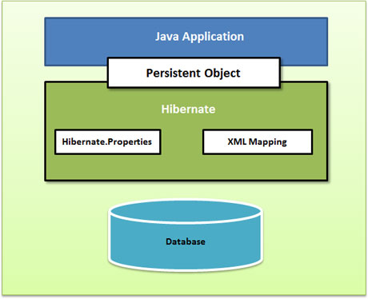
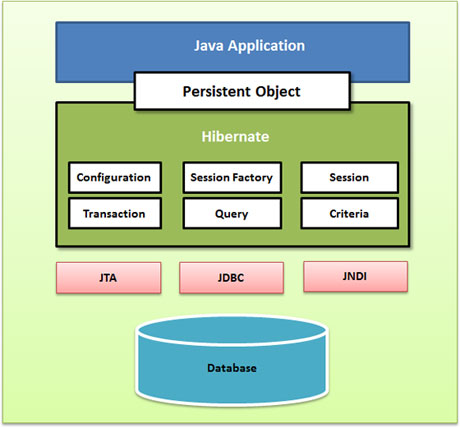

# Hibernate
Hibernate是一种ORM框架，全称为 Object_Relative DateBase-Mapping，在Java对象与关系数据库之间建立某种映射，以实现直接存取Java对象！   
    

Hibernate 使用 XML 文件来处理映射 Java 类别到数据库表格中，并且不用编写任何代码。  
为在数据库中直接储存和检索 Java 对象提供简单的 APIs。  
抽象不熟悉的 SQL 类型，并为我们提供工作中所熟悉的 Java 对象。    
Hibernate 不需要应用程序服务器来操作。    
操控你数据库中对象复杂的关联。  
最小化与访问数据库的智能提取策略。  
提供简单的数据询问。   

## Hibernate 架构
Hibernate 应用程序架构视图:  
     
详细的 Hibernate 应用程序体系结构视图以及一些重要的类。   
       

**配置对象**  
配置对象是你在任何 Hibernate 应用程序中创造的第一个 Hibernate 对象，并且经常只在应用程序初始化期间创造。它代表了 Hibernate 所需一个配置或属性文件。配置对象提供了两种基础组件。  
* 数据库连接：由 Hibernate 支持的一个或多个配置文件处理。这些文件是 hibernate.properties 和 hibernate.cfg.xml。  
* 类映射设置：这个组件创造了 Java 类和数据库表格之间的联系。  

**SessionFactory 对象**  
配置对象被用于创造一个 SessionFactory 对象，使用提供的配置文件为应用程序依次配置 Hibernate，并允许实例化一个会话对象。SessionFactory 是一个线程安全对象并由应用程序所有的线程所使用。  
SessionFactory 是一个重量级对象所以通常它都是在应用程序启动时创造然后留存为以后使用。每个数据库需要一个 SessionFactory 对象使用一个单独的配置文件。所以如果你使用多种数据库那么你要创造多种 SessionFactory 对象。  
**Session 对象**    
一个会话被用于与数据库的物理连接。Session 对象是轻量级的，并被设计为每次实例化都需要与数据库的交互。持久对象通过 Session 对象保存和检索。  
Session 对象不应该长时间保持开启状态因为它们通常情况下并非线程安全，并且它们应该按照所需创造和销毁。  
**Transaction 对象**   
一个事务代表了与数据库工作的一个单元并且大部分 RDBMS 支持事务功能。在 Hibernate 中事务由底层事务管理器和事务（来自 JDBC 或者 JTA）处理。  
这是一个选择性对象，Hibernate 应用程序可能不选择使用这个接口，而是在自己应用程序代码中管理事务。  
**Query 对象**  
Query 对象使用 SQL 或者 Hibernate 查询语言（HQL）字符串在数据库中来检索数据并创造对象。一个查询的实例被用于连结查询参数，限制由查询返回的结果数量，并最终执行查询。  
**Criteria 对象**   
Criteria 对象被用于创造和执行面向规则查询的对象来检索对象。  

## 环境配置
在maven的pom.xml中配置  

	<dependency>
      <groupId>org.hibernate</groupId>
      <artifactId>hibernate-core</artifactId>
      <version>5.2.10.Final</version>
    </dependency>

## 配置对象
Hibernate 需要事先知道在哪里找到映射信息，这些映射信息定义了 Java 类怎样关联到数据库表。Hibernate 也需要一套相关数据库和其它相关参数的配置设置。所有这些信息通常是作为一个标准的 Java 属性文件提供的，名叫 hibernate.properties。又或者是作为 XML 文件提供的，名叫 hibernate.cfg.xml。  
一般使用hibernate.cfg.xml 这个 XML 格式文件来决定在我的例子里指定需要的 Hibernate 应用属性，保存在应用程序的类路径的根目录里。   

	<?xml version="1.0" encoding="utf-8"?>
	<!DOCTYPE hibernate-configuration SYSTEM 
	"http://www.hibernate.org/dtd/hibernate-configuration-3.0.dtd">
	
	<hibernate-configuration>
	   <session-factory>
	   <!-- 这个属性使 Hibernate 应用为被选择的数据库生成适当的 SQL -->
	   <property name="hibernate.dialect">
	      org.hibernate.dialect.MySQLDialect
	   </property>
	   <!-- JDBC 驱动程序类 -->
	   <property name="hibernate.connection.driver_class">
	      com.mysql.jdbc.Driver
	   </property>
	
	   <!-- 数据库实例的 JDBC URL,连接test数据库 -->
	   <property name="hibernate.connection.url">
	      jdbc:mysql://localhost/test
	   </property>
	   <!-- 数据库用户名 -->
	   <property name="hibernate.connection.username">
	      root
	   </property>
	   <!-- 数据库密码 -->
	   <property name="hibernate.connection.password">
	      root123
	   </property>
       <!-- 可以将向数据库发送的SQL语句显示出来 -->
       <property name="hibernate.show_sql">true</property>
       <!-- 格式化SQL语句 -->
       <property name="hibernate.format_sql">true</property>
	   <!-- 限制在 Hibernate 应用数据库连接池中连接的数量 -->
       <property name="hibernate.connection.pool_size">10</property>
       <!-- 允许在 JDBC 连接中使用自动提交模式 -->
       <property name="hibernate.connection.autocommit">true</property>
	   <!-- 配置hibernate的映射文件所在的位置 -->
	   <!-- List of XML mapping files -->
	   <mapping resource="Employee.hbm.xml"/>
	
	</session-factory>
	</hibernate-configuration>   

## Session
Session 用于获取与数据库的物理连接。  
Session 对象是轻量级的，并且设计为在每次需要与数据库进行交互时被实例化。持久态对象被保存，并通过 Session 对象检索找回。  
该 Session 对象不应该长时间保持开放状态，因为它们通常不能保证线程安全，而应该根据需求被创建和销毁。Session 的主要功能是为映射实体类的实例提供创建，读取和删除操作。这些实例可能在给定时间点时存在于以下三种状态之一：  
* 瞬时状态: 一种新的持久性实例，被 Hibernate 认为是瞬时的，它不与 Session 相关联，在数据库中没有与之关联的记录且无标识符值。  
* 持久状态：可以将一个瞬时状态实例通过与一个 Session 关联的方式将其转化为持久状态实例。持久状态实例在数据库中没有与之关联的记录，有标识符值，并与一个 Session 关联。  
* 脱管状态：一旦关闭 Hibernate Session，持久状态实例将会成为脱管状态实例。  

若 Session 实例的持久态类别是序列化的，则该 Session 实例是序列化的。一个典型的事务应该使用以下语法,如果 Session 引发异常，则事务必须被回滚，该 session 必须被丢弃。    

	Session session = factory.openSession();
	Transaction tx = null;
	try {
	   tx = session.beginTransaction();
	   // do some work
	   ...
	   tx.commit();
	}
	catch (Exception e) {
	   if (tx!=null) tx.rollback();
	   e.printStackTrace(); 
	}finally {
	   session.close();
	}
	

Session 方法及说明:  
 
| 方法 | 说明 |
|  --   |  --  |
| Transaction beginTransaction() | 开始工作单位，并返回关联事务对象。 | 
| void cancelQuery() | 取消当前的查询执行 |
| void clear() | 完全清除该会话 |
| Connection close() | 通过释放和清理 JDBC 连接以结束该会话。 |
| Criteria createCriteria(Class persistentClass)  | 为给定的实体类或实体类的超类创建一个新的 Criteria 实例。 |
| Criteria createCriteria(String entityName) | 为给定的实体名称创建一个新的 Criteria 实例。 |
| Serializable getIdentifier(Object object)  | 返回与给定实体相关联的会话的标识符值。 |
| Query createFilter(Object collection, String queryString)  | 为给定的集合和过滤字符创建查询的新实例。 |
| Query createQuery(String queryString)  | 为给定的 HQL 查询字符创建查询的新实例。 |
| SQLQuery createSQLQuery(String queryString)  | 为给定的 SQL 查询字符串创建 SQLQuery 的新实例。 |
| void delete(Object object) | 从数据存储中删除持久化实例 |
| void delete(String entityName, Object object) | 从数据存储中删除持久化实例 |
| Session get(String entityName, Serializable id) | 返回给定命名的且带有给定标识符或 null 的持久化实例（若无该种持久化实例）。 |
| SessionFactory getSessionFactory() | 获取创建该会话的 session 工厂。 |
| void refresh(Object object) | 从基本数据库中重新读取给定实例的状态 |
| Transaction getTransaction()  | 获取与该 session 关联的事务实例 |
| boolean isConnected() | 检查当前 session 是否连接。 |
| boolean isDirty()  | 该 session 中是否包含必须与数据库同步的变化？ |
| boolean isOpen()  | 检查该 session 是否仍处于开启状态。 |
| Serializable save(Object object) | 先分配一个生成的标识，以保持给定的瞬时状态实例。 |
| void saveOrUpdate(Object object) | 保存（对象）或更新（对象）给定的实例 |
| void update(Object object)  | 更新带有标识符且是给定的处于脱管状态的实例的持久化实例 |
| void update(String entityName, Object object) | 更新带有标识符且是给定的处于脱管状态的实例的持久化实例 |

## 持久化类 Bean
Hibernate 的完整概念是提取 Java 类属性中的值，并且将它们保存到数据库表单中。映射文件能够帮助 Hibernate 确定如何从该类中提取值，并将它们映射在表格和相关域中。  
在 Hibernate 中，其对象或实例将会被存储在数据库表单中的 Java 类被称为持久化类。  
持久化类的主要规则:  
* 所有将被持久化的 Java 类都需要一个默认的构造函数
* 为了使对象能够在 Hibernate 和数据库中容易识别，所有类都需要包含一个 ID。此属性映射到数据库表的主键列。  
* 所有将被持久化的属性都应该声明为 private，并具有由 JavaBean 风格定义的 getXXX 和 setXXX 方法。  
* 所有的类是不可扩展或按 EJB 要求实现的一些特殊的类和接口。  

一个简单的 POJO 的例子:

	public class Employee {
	   private int id;
	   private String firstName; 
	   private String lastName;   
	   private int salary;  
	
	   public Employee() {}
	   public Employee(String fname, String lname, int salary) {
	      this.firstName = fname;
	      this.lastName = lname;
	      this.salary = salary;
	   }
	   public int getId() {
	      return id;
	   }
	   public void setId( int id ) {
	      this.id = id;
	   }
	   public String getFirstName() {
	      return firstName;
	   }
	   public void setFirstName( String first_name ) {
	      this.firstName = first_name;
	   }
	   public String getLastName() {
	      return lastName;
	   }
	   public void setLastName( String last_name ) {
	      this.lastName = last_name;
	   }
	   public int getSalary() {
	      return salary;
	   }
	   public void setSalary( int salary ) {
	      this.salary = salary;
	   }
	}
	
## 映射文件
一个对象/关系型映射一般定义在 XML 文件中。映射文件指示 Hibernate 如何将已经定义的类或类组与数据库中的表对应起来。以格式 &lt;classname&gt;.hbm.xml保存映射文件  

	<?xml version="1.0" encoding="utf-8"?>
	<!DOCTYPE hibernate-mapping PUBLIC 
	 "-//Hibernate/Hibernate Mapping DTD//EN"
	 "http://www.hibernate.org/dtd/hibernate-mapping-3.0.dtd"> 
	
	<hibernate-mapping>
	   <class name="Employee" table="EMPLOYEE">
	      <meta attribute="class-description">
	         This class contains the employee detail. 
	      </meta>
	      <id name="id" type="int" column="id">
	         <generator class="native"/>
	      </id>
	      <property name="firstName" column="first_name" type="string"/>
	      <property name="lastName" column="last_name" type="string"/>
	      <property name="salary" column="salary" type="int"/>
	   </class>
	</hibernate-mapping>

* 映射文件是一个以hibernate-mapping为根元素的 XML 文件，里面包含所有class标签。
* class 标签是用来定义从一个 Java 类到数据库表的特定映射。Java 的类名使用 name 属性来表示，数据库表明用 table 属性来表示。
* meta 标签是一个可选元素，可以被用来修饰类。
* id 标签将类中独一无二的 ID 属性与数据库表中的主键关联起来。id 元素中的 name 属性引用类的性质，column 属性引用数据库表的列。type 属性保存 Hibernate 映射的类型，这个类型会将从 Java 转换成 SQL 数据类型。  
* 在 id 元素中的 generator 标签用来自动生成主键值。设置 generator 标签中的 class 属性可以设置 native 使 Hibernate 可以使用 identity, sequence 或 hilo 算法根据底层数据库的情况来创建主键。
* property 标签用来将 Java 类的属性与数据库表的列匹配。标签中 name 属性引用的是类的性质，column 属性引用的是数据库表的列。type 属性保存 Hibernate 映射的类型，这个类型会将从 Java 转换成 SQL 数据类型。    

## 注解
Hibernate 可以使用 XML 映射文件来完成从 POJO 到数据库表的数据转换；也可以通过注解的方式来完成从 POJO 到数据库表的数据转换。  
Hibernate 注解是一种强大的来给对象和关系映射表提供元数据的方法。所有的元数据被添加到 POJO java 文件代码中，这有利于用户在开发时更好的理解表的结构和 POJO。  
使用注解来表示映射信息，可以更好的移植；使用基于 XML 的映射,可以得到更大的灵活性。  

	@Entity
	@Table(name="user_info")
	public class UserBean {
	    @Id
	    @GeneratedValue
	    @Column(name="user_id")
	    private int id;
	    @Column(name="user_name")
	    private String username;
	    @Column(name="user_phone")
	    private String phone;
	    @Column(name="user_website")
	    private String website;
	    @Column(name="user_dept")
	    private String dept;
	
	    public UserBean(){};
	    public UserBean(int id){
	        this.id = id;
	    }
		getter and setter function
	}

@Entity：标志着这个类为一个实体 bean，所以它必须含有一个没有参数的构造函数并且在可保护范围是可见的。  
@Table：明确表的详细信息保证实体在数据库中持续存在，提供了四个属性，表的名称，目录,模式,在表中可以对列制定独特的约束。  
@Id:主键
@GeneratedValue:主键生成策略  
@Column:指定某一列与某一个字段或是属性映射的细节信息,常用的属性:name 属性允许显式地指定列的名称,length 属性为用于映射一个值，特别为一个字符串值的列的大小,nullable 属性允许当生成模式时，一个列可以被标记为非空,unique 属性允许列中只能含有唯一的内容

使用注解方式获取factory方式有所不同：  
factory = new Configuration().configure().addAnnotatedClass(UserBean.class).buildSessionFactory();  

## Hibernate查询语言HQL
Hibernate 查询语言（HQL）是一种面向对象的查询语言，类似于 SQL，但不是去对表和列进行操作，而是面向对象和它们的属性。 HQL 查询被 Hibernate 翻译为传统的 SQL 查询从而对数据库进行操作。  
在 HQL 中一些关键字比如 SELECT ，FROM 和 WHERE 等，是不区分大小写的，但是一些属性比如表名和列名是区分大小写的。  

**FROM 语句**  

	String hql = "FROM Employee";
	//完全限定类名
	String hql = "FROM com.hibernatebook.criteria.Employee";  
	Query query = session.createQuery(hql);
	List results = query.list();

**AS 语句**  
AS 语句能够用来给你的类分配别名，尤其是在长查询的情况下  

	String hql = "FROM Employee AS E";  

**SELECT 语句**  
如果只想得到对象的几个**属性**而不是整个对象你需要使用 SELECT 语句。  

	String hql = "SELECT E.firstName FROM Employee E";  

**WHERE 语句**  
想要精确地从数据库存储中返回特定对象，你需要使用 WHERE 语句  

	String hql = "FROM Employee E WHERE E.id = 10";  

**ORDER BY 语句**  
为了给 HSQ 查询结果进行排序，你将需要使用 ORDER BY 语句。你能利用任意一个属性给你的结果进行排序，包括升序或降序排序。  

	String hql = "FROM Employee E WHERE E.id > 10 ORDER BY E.salary DESC";
	如果你想要给多个属性进行排序，你只需要在 ORDER BY 语句后面添加你要进行排序的属性即可，并且用逗号进行分割：
	String hql = "FROM Employee E WHERE E.id > 10 ORDER BY E.firstName DESC, E.salary DESC ";  

**GROUP BY 语句**  

	String hql = "SELECT SUM(E.salary), E.firtName FROM Employee E " +
             "GROUP BY E.firstName";  

**UPDATE 语句**  
HQL Hibernate 3 较 HQL Hibernate 2，新增了批量更新功能和选择性删除工作的功能。查询接口包含一个 executeUpdate() 方法，可以执行 HQL 的 UPDATE 或 DELETE 语句。 
UPDATE 语句能够更新一个或多个对象的一个或多个属性。  

	String hql = "UPDATE Employee set salary = :salary "  + 
             "WHERE id = :employee_id";
	Query query = session.createQuery(hql);
	query.setParameter("salary", 1000);
	query.setParameter("employee_id", 10);
	int result = query.executeUpdate();
	System.out.println("Rows affected: " + result);

**DELETE 语句**   

	String hql = "DELETE FROM Employee "  + 
             "WHERE id = :employee_id";
	Query query = session.createQuery(hql);
	query.setParameter("employee_id", 10);
	int result = query.executeUpdate();
	System.out.println("Rows affected: " + result);
	
**INSERT 语句**  

	String hql = "INSERT INTO Employee(firstName, lastName, salary)"  + 
	             "SELECT firstName, lastName, salary FROM old_employee";
	Query query = session.createQuery(hql);
	int result = query.executeUpdate();
	System.out.println("Rows affected: " + result);

**使用分页查询**  

	String hql = "FROM Employee";
	Query query = session.createQuery(hql);
	query.setFirstResult(1);  表示结果中的第一行,从 0 行开始。
	query.setMaxResults(10);  告诉 Hibernate 来检索固定数量个对象
	List results = query.list();  

## 原生 SQL
如果你想使用数据库特定的功能如查询提示或 Oracle 中的 CONNECT 关键字的话，你可以使用原生 SQL 数据库来表达查询。Hibernate 3.x 允许您为所有的创建，更新，删除，和加载操作指定手写 SQL ，包括存储过程。  
您的应用程序会在会话界面用 createSQLQuery() 方法创建一个原生 SQL 查询  

	String sql = "SELECT * FROM EMPLOYEE WHERE id = :employee_id";
	SQLQuery query = session.createSQLQuery(sql);
	query.addEntity(Employee.class);
	query.setParameter("employee_id", 10);
	List results = query.list();  

## Hibernate 缓存
https://www.w3cschool.cn/hibernate/xrvi1iee.html  

## 批处理
使用 Hibernate 将大量的数据上传到你的数据库中  

	Session session = SessionFactory.openSession();
	Transaction tx = session.beginTransaction();
	for ( int i=0; i<100000; i++ ) {
	    Employee employee = new Employee(.....);
	    session.save(employee);
	}
	tx.commit();
	session.close();
	//批处理代码
	Session session = SessionFactory.openSession();
	Transaction tx = session.beginTransaction();
	for ( int i=0; i<100000; i++ ) {
	    Employee employee = new Employee(.....);
	    session.save(employee);
	    if( i % 50 == 0 ) { // Same as the JDBC batch size
	        //flush a batch of inserts and release memory:
	        session.flush();
	        session.clear();
	    }
	}
	tx.commit();
	session.close();

## Hibernate 拦截器
Hibernate 拦截器给予了我们一个对象如何应用到应用程序和数据库的总控制,在对象持久化或从数据库读取过程中，对数据进行检查。  
在 Hibernate 中，一个对象将被创建，保存过程中存在不同的状态。
对象处于生命周期的不同状态下， Interceptor 接口提供了不同阶段能被调用来进行一些所需要的任务的方法。这些方法是从会话到应用程序的回调函数，允许应用程序检查或操作一个持续对象的属性，在它被保存，更新，删除或上传之前。  
 

创建一个拦截器你可以直接实现 Interceptor 类或者继承 EmptyInterceptor 类。  

创建拦截器，当 Employee 对象被创建和更新时拦截器的方法将自动被调用。  

	public class MyInterceptor extends EmptyInterceptor {
	   private int updates;
	   private int creates;
	   private int loads;
	
	   public void onDelete(Object entity,
	                     Serializable id,
	                     Object[] state,
	                     String[] propertyNames,
	                     Type[] types) {
	       // do nothing
	   }
	
	   // This method is called when Employee object gets updated.
	   public boolean onFlushDirty(Object entity,
	                     Serializable id,
	                     Object[] currentState,
	                     Object[] previousState,
	                     String[] propertyNames,
	                     Type[] types) {
	       if ( entity instanceof Employee ) {
	          System.out.println("Update Operation");
	          return true; 
	       }
	       return false;
	   }
	   public boolean onLoad(Object entity,
	                    Serializable id,
	                    Object[] state,
	                    String[] propertyNames,
	                    Type[] types) {
	       // do nothing
	       return true;
	   }
	   // This method is called when Employee object gets created.
	   public boolean onSave(Object entity,
	                    Serializable id,
	                    Object[] state,
	                    String[] propertyNames,
	                    Type[] types) {
	       if ( entity instanceof Employee ) {
	          System.out.println("Create Operation");
	          return true; 
	       }
	       return false;
	   }
	   //called before commit into database
	   public void preFlush(Iterator iterator) {
	      System.out.println("preFlush");
	   }
	   //called after committed into database
	   public void postFlush(Iterator iterator) {
	      System.out.println("postFlush");
	   }
	}  

