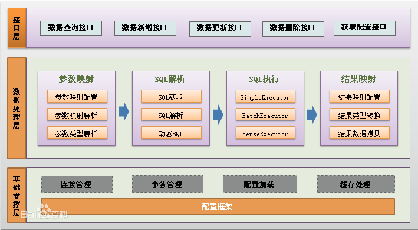
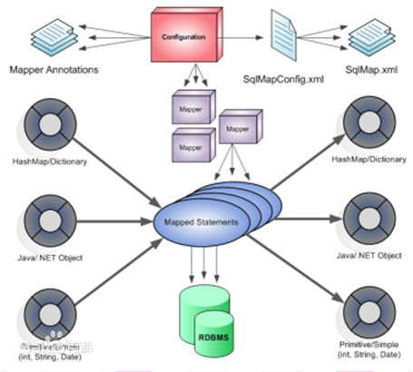

# MyBatis  
MyBatis 是一款优秀的持久层框架，它支持定制化 SQL、存储过程以及高级映射。MyBatis 避免了几乎所有的 JDBC 代码和手动设置参数以及获取结果集。MyBatis 可以使用简单的 XML 或注解来配置和映射原生信息，将接口和 Java 的 POJOs(Plain Ordinary Java Object,普通的 Java对象)映射成数据库中的记录   

每个MyBatis应用程序主要都是使用SqlSessionFactory实例的，一个SqlSessionFactory实例可以通过SqlSessionFactoryBuilder获得。SqlSessionFactoryBuilder可以从一个xml配置文件或者一个预定义的配置类的实例获得。  

用xml文件构建SqlSessionFactory实例是非常简单的事情。推荐在这个配置中使用类路径资源（classpath resource)，但你可以使用任何Reader实例，包括用文件路径或file://开头的url创建的实例。MyBatis有一个实用类----Resources，它有很多方法，可以方便地从类路径及其它位置加载资源。  

## 特点
* 简单易学：本身就很小且简单。没有任何第三方依赖，最简单安装只要两个jar文件+配置几个sql映射文件易于学习，易于使用，通过文档和源代码，可以比较完全的掌握它的设计思路和实现。
* 灵活：mybatis不会对应用程序或者数据库的现有设计强加任何影响。 sql写在xml里，便于统一管理和优化。通过sql语句可以满足操作数据库的所有需求。
* 解除sql与程序代码的耦合：通过提供DAO层，将业务逻辑和数据访问逻辑分离，使系统的设计更清晰，更易维护，更易单元测试。sql和代码的分离，提高了可维护性。
* 提供映射标签，支持对象与数据库的orm字段关系映射
* 提供对象关系映射标签，支持对象关系组建维护
* 提供xml标签，支持编写动态sql

## 功能架构
      
* API接口层：提供给外部使用的接口API，开发人员通过这些本地API来操纵数据库。接口层一接收到调用请求就会调用数据处理层来完成具体的数据处理。
* 数据处理层：负责具体的SQL查找、SQL解析、SQL执行和执行结果映射处理等。它主要的目的是根据调用的请求完成一次数据库操作。
* 基础支撑层：负责最基础的功能支撑，包括连接管理、事务管理、配置加载和缓存处理，这些都是共用的东西，将他们抽取出来作为最基础的组件。为上层的数据处理层提供最基础的支撑。  

## 框架架构  
       
* 加载配置：配置来源于两个地方，一处是**配置文件**，一处是**Java代码的注解**，将SQL的配置信息加载成为一个个MappedStatement对象（包括了传入参数映射配置、执行的SQL语句、结果映射配置），存储在内存中。  
* SQL解析：当API接口层接收到调用请求时，会接收到传入SQL的ID和传入对象（可以是Map、JavaBean或者基本数据类型），Mybatis会根据SQL的ID找到对应的MappedStatement，然后根据传入参数对象对MappedStatement进行解析，解析后可以得到最终要执行的SQL语句和参数。  
* SQL执行：将最终得到的SQL和参数拿到数据库进行执行，得到操作数据库的结果  
* 结果映射：将操作数据库的结果按照映射的配置进行转换，可以转换成HashMap、JavaBean或者基本数据类型，并将最终结果返回。  

## 安装
要使用 MyBatis， 只需将 [mybatis-x.x.x.jar](https://github.com/mybatis/mybatis-3/releases) 文件置于 classpath 中即可。  
如果使用 Maven 来构建项目，则需将下面的 dependency 代码置于 pom.xml 文件中：   
 
	<dependency>
	  <groupId>org.mybatis</groupId>
	  <artifactId>mybatis</artifactId>
	  <version>x.x.x</version>
	</dependency>  

## XML配置
[具体参考](https://mybatis.org/mybatis-3/zh/configuration.html#properties)  
### 属性（properties）  
在 properties 元素体内指定的属性首先被读取。  
然后根据 properties 元素中的 resource 属性读取类路径下属性文件或根据 url 属性指定的路径读取属性文件，并覆盖已读取的同名属性。  
最后读取作为方法参数传递的属性，并覆盖已读取的同名属性。  

### 设置（settings）
决定MyBatis 的运行时行为  

### 类型别名（typeAliases）
类型别名是为 Java 类型设置一个短的名字。 它只和 XML 配置有关，存在的意义仅在于用来减少类完全限定名的冗余   

### 类型处理器（typeHandlers）
无论是 MyBatis 在预处理语句（PreparedStatement）中设置一个参数时，还是从结果集中取出一个值时， 都会用类型处理器将获取的值以合适的方式转换成 Java 类型  

### 对象工厂（objectFactory）
MyBatis 每次创建结果对象的新实例时，它都会使用一个对象工厂（ObjectFactory）实例来完成。 默认的对象工厂需要做的仅仅是实例化目标类，要么通过默认构造方法，要么在参数映射存在的时候通过参数构造方法来实例化。 如果想覆盖对象工厂的默认行为，则可以通过创建自己的对象工厂来实现。  

### 插件（plugins）
MyBatis 允许你在已映射语句执行过程中的某一点进行拦截调用。默认情况下，MyBatis 允许使用插件来拦截的方法调用包括：  
* Executor (update, query, flushStatements, commit, rollback, getTransaction, close, isClosed)
* ParameterHandler (getParameterObject, setParameters)
* ResultSetHandler (handleResultSets, handleOutputParameters)
* StatementHandler (prepare, parameterize, batch, update, query)  

如果你想做的不仅仅是监控方法的调用，那么你最好相当了解要重写的方法的行为。 因为如果在试图修改或重写已有方法的行为的时候，你很可能在破坏 MyBatis 的核心模块。 这些都是更低层的类和方法，所以使用插件的时候要特别当心。  
通过 MyBatis 提供的强大机制，使用插件是非常简单的，只需实现 Interceptor 接口，并指定想要拦截的方法签名即可。  

### 环境配置（environments）
MyBatis 可以配置成适应多种环境，这种机制有助于将 SQL 映射应用于多种数据库之中， 现实情况下有多种理由需要这么做。例如，开发、测试和生产环境需要有不同的配置；或者想在具有相同 Schema 的多个生产数据库中 使用相同的 SQL 映射。有许多类似的使用场景。    
**尽管可以配置多个环境，但每个 SqlSessionFactory 实例只能选择一种环境。**    
所以，如果你想连接两个数据库，就需要创建两个 SqlSessionFactory 实例，每个数据库对应一个。而如果是三个数据库，就需要三个实例，依此类推  

### 事务管理器（transactionManager）
在 MyBatis 中有两种类型的事务管理器（也就是 type=”[JDBC|MANAGED]”）  
* JDBC – 这个配置就是直接使用了 JDBC 的提交和回滚设置，它依赖于从数据源得到的连接来管理事务作用域。
* MANAGED – 这个配置几乎没做什么。它从来不提交或回滚一个连接，而是让容器来管理事务的整个生命周期（比如 JEE 应用服务器的上下文）。 默认情况下它会关闭连接，然而一些容器并不希望这样，因此需要将 closeConnection 属性设置为 false 来阻止它默认的关闭行为。  

> 如果你正在使用 Spring + MyBatis，则没有必要配置事务管理器， 因为 Spring 模块会使用自带的管理器来覆盖前面的配置  

### 数据源（dataSource）
有三种内建的数据源类型（也就是 type=”[UNPOOLED|POOLED|JNDI]”）  
* UNPOOLED– 这个数据源的实现只是每次被请求时打开和关闭连接。虽然有点慢，但对于在数据库连接可用性方面没有太高要求的简单应用程序来说，是一个很好的选择。 不同的数据库在性能方面的表现也是不一样的，对于某些数据库来说，使用连接池并不重要，这个配置就很适合这种情形。  
* POOLED– 这种数据源的实现利用“池”的概念将 JDBC 连接对象组织起来，避免了创建新的连接实例时所必需的初始化和认证时间。 这是一种使得并发 Web 应用快速响应请求的流行处理方式。  
* JNDI – 这个数据源的实现是为了能在如 EJB 或应用服务器这类容器中使用，容器可以集中或在外部配置数据源，然后放置一个 JNDI 上下文的引用。  

### 数据库厂商标识（databaseIdProvider）
MyBatis 可以根据不同的数据库厂商执行不同的语句，这种多厂商的支持是基于映射语句中的 databaseId 属性。 MyBatis 会加载不带 databaseId 属性和带有匹配当前数据库 databaseId 属性的所有语句。 如果同时找到带有 databaseId 和不带 databaseId 的相同语句，则后者会被舍弃。 为支持多厂商特性只要像下面这样在 mybatis-config.xml 文件中加入 databaseIdProvider 即可：  
  
	<databaseIdProvider type="DB_VENDOR">
	  <property name="SQL Server" value="sqlserver"/>
	  <property name="DB2" value="db2"/>
	  <property name="Oracle" value="oracle" />
	</databaseIdProvider>  

### 映射器（mappers）
Java 在自动查找这方面没有提供一个很好的方法，所以最佳的方式是告诉 MyBatis 到哪里去找映射文件。 你可以使用相对于类路径的资源引用， 或完全限定资源定位符（包括 file:/// 的 URL），或类名和包名等  

	<!-- 使用相对于类路径的资源引用 -->
	<mappers>
	  <mapper resource="org/mybatis/builder/AuthorMapper.xml"/>
	  <mapper resource="org/mybatis/builder/BlogMapper.xml"/>
	  <mapper resource="org/mybatis/builder/PostMapper.xml"/>
	</mappers>
	
	<!-- 使用完全限定资源定位符（URL） -->
	<mappers>
	  <mapper url="file:///var/mappers/AuthorMapper.xml"/>
	  <mapper url="file:///var/mappers/BlogMapper.xml"/>
	  <mapper url="file:///var/mappers/PostMapper.xml"/>
	</mappers>
	
	<!-- 使用映射器接口实现类的完全限定类名 -->
	<mappers>
	  <mapper class="org.mybatis.builder.AuthorMapper"/>
	  <mapper class="org.mybatis.builder.BlogMapper"/>
	  <mapper class="org.mybatis.builder.PostMapper"/>
	</mappers>
	
	<!-- 将包内的映射器接口实现全部注册为映射器 -->
	<mappers>
	  <package name="org.mybatis.builder"/>
	</mappers>

## XML 映射文件
MyBatis 的真正强大在于它的映射语句，这是它的魔力所在。由于它的异常强大，映射器的 XML 文件就显得相对简单。如果拿它跟具有相同功能的 JDBC 代码进行对比，你会立即发现省掉了将近 95% 的代码。MyBatis 为聚焦于 SQL 而构建，以尽可能地为你减少麻烦。  
SQL 映射文件只有很少的几个顶级元素（按照应被定义的顺序列出）：  
* cache – 对给定命名空间的缓存配置。
* cache-ref – 对其他命名空间缓存配置的引用。
* resultMap – 是最复杂也是最强大的元素，用来描述如何从数据库结果集中来加载对象。  
* sql – 可被其他语句引用的可重用语句块。  
* insert – 映射插入语句  
* update – 映射更新语句  
* delete – 映射删除语句  
* select – 映射查询语句  

### select
	<select id="selectPerson" parameterType="int" resultType="hashmap">
	  SELECT * FROM PERSON WHERE ID = #{id}
	</select>
这个语句被称作 selectPerson，接受一个 int（或 Integer）类型的参数，并返回一个 HashMap 类型的对象，其中的键是列名，值便是结果行中的对应值。  
select 元素允许你配置很多属性来配置每条语句的作用细节。  

	<select id="selectPerson" parameterType="int" parameterMap="deprecated"  resultType="hashmap" resultMap="personResultMap" 
	flushCache="false" useCache="true" timeout="10" fetchSize="256"  statementType="PREPARED" resultSetType="FORWARD_ONLY"> 

> id:在命名空间中唯一的标识符，可以被用来引用这条语句。
> parameterType:将会传入这条语句的参数类的完全限定名或别名。这个属性是可选的，因为 MyBatis 可以通过类型处理器（TypeHandler） 推断出具体传入语句的参数，默认值为未设置（unset）。
> ~~parameterMap:这是引用外部 parameterMap 的已经被废弃的方法。请使用内联参数映射和 parameterType 属性。~~    
> resultType:从这条语句中返回的期望类型的类的完全限定名或别名。 注意如果返回的是集合，那应该设置为集合包含的类型，而不是集合本身。可以使用 resultType 或 resultMap，但不能同时使用。  
> resultMap:外部 resultMap 的命名引用。结果集的映射是 MyBatis 最强大的特性，如果你对其理解透彻，许多复杂映射的情形都能迎刃而解。可以使用 resultMap 或 resultType，但不能同时使用。  
> flushCache:将其设置为 true 后，只要语句被调用，都会导致本地缓存和二级缓存被清空，默认值：false。  
> useCache:将其设置为 true 后，将会导致本条语句的结果被二级缓存缓存起来，默认值：对 select 元素为 true。  
> timeout:这个设置是在抛出异常之前，驱动程序等待数据库返回请求结果的秒数。默认值为未设置（unset）（依赖驱动）。  
> fetchSize:这是一个给驱动的提示，尝试让驱动程序每次批量返回的结果行数和这个设置值相等。 默认值为未设置（unset）（依赖驱动）。  
> statementType:STATEMENT，PREPARED 或 CALLABLE 中的一个。这会让 MyBatis 分别使用 Statement，PreparedStatement 或 CallableStatement，默认值：PREPARED。  
> resultSetType:FORWARD_ONLY，SCROLL_SENSITIVE, SCROLL_INSENSITIVE 或 DEFAULT（等价于 unset） 中的一个，默认值为 unset （依赖驱动）。  
> databaseId:如果配置了数据库厂商标识（databaseIdProvider），MyBatis 会加载所有的不带 databaseId 或匹配当前 databaseId 的语句；如果带或者不带的语句都有，则不带的会被忽略。  
> resultOrdered:这个设置仅针对嵌套结果 select 语句适用：如果为 true，就是假设包含了嵌套结果集或是分组，这样的话当返回一个主结果行的时候，就不会发生有对前面结果集的引用的情况。 这就使得在获取嵌套的结果集的时候不至于导致内存不够用。默认值：false。  
> resultSets:这个设置仅对多结果集的情况适用。它将列出语句执行后返回的结果集并给每个结果集一个名称，名称是逗号分隔的。  

### insert, update 和 delete
	<insert
	  id="insertAuthor"
	  parameterType="domain.blog.Author"
	  flushCache="true"
	  statementType="PREPARED"
	  keyProperty=""
	  keyColumn=""
	  useGeneratedKeys=""
	  timeout="20">
		insert into Author (id,username,password,email,bio)
		values (#{id},#{username},#{password},#{email},#{bio})
	</insert>
	
	<update
	  id="updateAuthor"
	  parameterType="domain.blog.Author"
	  flushCache="true"
	  statementType="PREPARED"
	  timeout="20">
		update Author set
    	username = #{username},
    	assword = #{password},
    	email = #{email},
    	bio = #{bio}
		where id = #{id}
	</update>
	
	<delete
	  id="deleteAuthor"
	  parameterType="domain.blog.Author"
	  flushCache="true"
	  statementType="PREPARED"
	  timeout="20">
		delete from Author where id = #{id}
	</delete>

> id:命名空间中的唯一标识符，可被用来代表这条语句。 
> parameterType:将要传入语句的参数的完全限定类名或别名。这个属性是可选的，因为 MyBatis 可以通过类型处理器推断出具体传入语句的参数，默认值为未设置（unset）。  
> ~~parameterMap:这是引用外部 parameterMap 的已经被废弃的方法。请使用内联参数映射和 parameterType 属性。~~  
> flushCache:将其设置为 true 后，只要语句被调用，都会导致本地缓存和二级缓存被清空，默认值：true（对于 insert、update 和 delete 语句）。  
> timeout:这个设置是在抛出异常之前，驱动程序等待数据库返回请求结果的秒数。默认值为未设置（unset）（依赖驱动）。  
> statementType:STATEMENT，PREPARED 或 CALLABLE 的一个。这会让 MyBatis 分别使用 Statement，PreparedStatement 或 CallableStatement，默认值：PREPARED。  
> useGeneratedKeys:（仅对 insert 和 update 有用）这会令 MyBatis 使用 JDBC 的 getGeneratedKeys 方法来取出由数据库内部生成的主键（比如：像 MySQL 和 SQL Server 这样的关系数据库管理系统的自动递增字段），默认值：false。  
> keyProperty:（仅对 insert 和 update 有用）唯一标记一个属性，MyBatis 会通过 getGeneratedKeys 的返回值或者通过 insert 语句的 selectKey 子元素设置它的键值，默认值：未设置（unset）。如果希望得到多个生成的列，也可以是逗号分隔的属性名称列表。  
> keyColumn:（仅对 insert 和 update 有用）通过生成的键值设置表中的列名，这个设置仅在某些数据库（像 PostgreSQL）是必须的，当主键列不是表中的第一列的时候需要设置。如果希望使用多个生成的列，也可以设置为逗号分隔的属性名称列表。  
> databaseId	如果配置了数据库厂商标识（databaseIdProvider），MyBatis 会加载所有的不带 databaseId 或匹配当前 databaseId 的语句；如果带或者不带的语句都有，则不带的会被忽略。  

### sql
这个元素可以被用来定义可重用的 SQL 代码段，这些 SQL 代码可以被包含在其他语句中。它可以（在加载的时候）被静态地设置参数。 在不同的包含语句中可以设置不同的值到参数占位符上。  

	<sql id="userColumns"> ${alias}.id,${alias}.username,${alias}.password </sql>
这个 SQL 片段可以被包含在其他语句中，例如：

	<select id="selectUsers" resultType="map">
	  select
	    <include refid="userColumns"><property name="alias" value="t1"/></include>,
	    <include refid="userColumns"><property name="alias" value="t2"/></include>
	  from some_table t1
	    cross join some_table t2
	</select>
属性值也可以被用在 include 元素的 refid 属性里或 include 元素的内部语句中  

	<sql id="sometable">
	  ${prefix}Table
	</sql>
	
	<sql id="someinclude">
	  from
	    <include refid="${include_target}"/>
	</sql>
	
	<select id="select" resultType="map">
	  select
	    field1, field2, field3
	  <include refid="someinclude">
	    <property name="prefix" value="Some"/>
	    <property name="include_target" value="sometable"/>
	  </include>
	</select>

### 参数  

### 字符串替换  

### 结果映射  

## 使用 Java 注解来配置
	package org.mybatis.example;
	public interface BlogMapper {
	  @Select("SELECT * FROM blog WHERE id = #{id}")
	  Blog selectBlog(int id);
	}  
使用注解来映射简单语句会使代码显得更加简洁，然而对于稍微复杂一点的语句，Java 注解就力不从心了，并且会显得更加混乱。 因此，如果你需要完成很复杂的事情，那么最好使用 XML 来映射语句。

## 动态 SQL
MyBatis 的强大特性之一便是它的动态 SQL。如果你有使用 JDBC 或其它类似框架的经验，你就能体会到根据不同条件拼接 SQL 语句的痛苦。例如拼接时要确保不能忘记添加必要的空格，还要注意去掉列表最后一个列名的逗号。利用动态 SQL 这一特性可以彻底摆脱这种痛苦。  
MyBatis 采用功能强大的基于 OGNL 的表达式  
* if
* choose (when, otherwise)
* trim (where, set)
* foreach

### if
动态 SQL 通常要做的事情是根据条件包含 where 子句的一部分,比如：  

	<select id="findActiveBlogWithTitleLike"
	     resultType="Blog">
	  SELECT * FROM BLOG
	  WHERE state = ‘ACTIVE’
	  <if test="title != null">
	    AND title like #{title}
	  </if>
	</select>  

### choose, when, otherwise
有时我们不想应用到所有的条件语句，而只想从中择其一项。针对这种情况，MyBatis 提供了 choose 元素，它有点像 Java 中的 switch 语句。  
还是上面的例子，但是这次变为提供了“title”就按“title”查找，提供了“author”就按“author”查找的情形，若两者都没有提供，就返回所有符合条件的 BLOG  

	<select id="findActiveBlogLike"
	     resultType="Blog">
	  SELECT * FROM BLOG WHERE state = ‘ACTIVE’
	  <choose>
	    <when test="title != null">
	      AND title like #{title}
	    </when>
	    <when test="author != null and author.name != null">
	      AND author_name like #{author.name}
	    </when>
	    <otherwise>
	      AND featured = 1
	    </otherwise>
	  </choose>
	</select>

### trim, where, set
	<select id="findActiveBlogLike"
	     resultType="Blog">
	  SELECT * FROM BLOG
	  <where>
	    <if test="state != null">
	         state = #{state}
	    </if>
	    <if test="title != null">
	        AND title like #{title}
	    </if>
	    <if test="author != null and author.name != null">
	        AND author_name like #{author.name}
	    </if>
	  </where>
	</select>  
where 元素只会在至少有一个子元素的条件返回 SQL 子句的情况下才去插入“WHERE”子句。而且，若语句的开头为“AND”或“OR”，where 元素也会将它们去除。  

	<update id="updateAuthorIfNecessary">
	  update Author
	    <set>
	      <if test="username != null">username=#{username},</if>
	      <if test="password != null">password=#{password},</if>
	      <if test="email != null">email=#{email},</if>
	      <if test="bio != null">bio=#{bio}</if>
	    </set>
	  where id=#{id}
	</update>
set 元素会动态前置 SET 关键字，同时也会删掉无关的逗号，因为用了条件语句之后很可能就会在生成的 SQL 语句的后面留下这些逗号。  

### foreach  
动态 SQL 的另外一个常用的操作需求是对一个集合进行遍历，通常是在构建 IN 条件语句的时候  

	<select id="selectPostIn" resultType="domain.blog.Post">
	  SELECT *
	  FROM POST P
	  WHERE ID in
	  <foreach item="item" index="index" collection="list"
	      open="(" separator="," close=")">
	        #{item}
	  </foreach>
	</select>
foreach 元素的功能非常强大，它允许你指定一个集合，声明可以在元素体内使用的集合项（item）和索引（index）变量。它也允许你指定开头与结尾的字符串以及在迭代结果之间放置分隔符。这个元素是很智能的，因此它不会偶然地附加多余的分隔符。    
> 你可以将任何可迭代对象（如 List、Set 等）、Map 对象或者数组对象传递给 foreach 作为集合参数。当使用可迭代对象或者数组时，index 是当前迭代的次数，item 的值是本次迭代获取的元素。当使用 Map 对象（或者 Map.Entry 对象的集合）时，index 是键，item 是值。  

## 作用域（Scope）和生命周期  
理解我们目前已经讨论过的不同作用域和生命周期类是至关重要的，因为错误的使用会导致非常严重的并发问题。  
> 注：依赖注入框架可以创建线程安全的、基于事务的 SqlSession 和映射器，并将它们直接注入到你的 bean 中，因此可以直接忽略它们的生命周期。 如果对如何通过依赖注入框架来使用 MyBatis 感兴趣，可以研究一下 MyBatis-Spring 或 MyBatis-Guice 两个子项目。  

* **SqlSessionFactoryBuilder**：SqlSessionFactoryBuilder 实例的最佳作用域是**方法作用域**（也就是局部方法变量），可以重用 SqlSessionFactoryBuilder 来创建多个 SqlSessionFactory 实例，但是最好还是不要让其一直存在，以保证所有的 XML 解析资源可以被释放给更重要的事情  
* **SqlSessionFactory**：SqlSessionFactory 的最佳作用域是**应用作用域**。SqlSessionFactory 的最佳作用域是应用作用域。最简单的就是使用单例模式或者静态单例模式。  
* **SqlSession**：每个线程都应该有它自己的 SqlSession 实例。SqlSession 的实例不是线程安全的，因此是不能被共享的，所以它的最佳的作用域是**请求或方法作用域**。 绝对不能将 SqlSession 实例的引用放在一个类的静态域，甚至一个类的实例变量也不行。 也绝不能将 SqlSession 实例的引用放在任何类型的托管作用域中，比如 Servlet 框架中的 HttpSession。 如果你现在正在使用一种 Web 框架，要考虑 SqlSession 放在一个和 HTTP 请求对象相似的作用域中。 换句话说，每次收到的 HTTP 请求，就可以打开一个 SqlSession，返回一个响应，就关闭它。 这个关闭操作是很重要的，你应该把这个关闭操作放到 finally 块中以确保每次都能执行关闭。  
* **映射器实例**：映射器是一些由你创建的、绑定你映射的语句的接口。映射器接口的实例是从 SqlSession 中获得的。因此从技术层面讲，任何映射器实例的最大作用域是和请求它们的 SqlSession 相同的。尽管如此，映射器实例的最佳作用域是**方法作用域**。 也就是说，映射器实例应该在调用它们的方法中被请求，用过之后即可丢弃。 并**不需要显式地关闭映射器实例**，尽管在整个请求作用域保持映射器实例也不会有什么问题，但是你很快会发现，像 SqlSession 一样，在这个作用域上管理太多的资源的话会难于控制。 为了避免这种复杂性，最好把映射器放在方法作用域内。    

mybatis提供一种“半自动化”的ORM实现。
   这里的“半自动化”，是相对Hibernate等提供了全面的数据库封装机制的“全自动化”ORM实现而言，“全自动”ORM实现了POJO和数据库表之间的映射，以及 SQL 的自动生成和执行。

    而mybatis的着力点，则在于POJO与SQL之间的映射关系。

