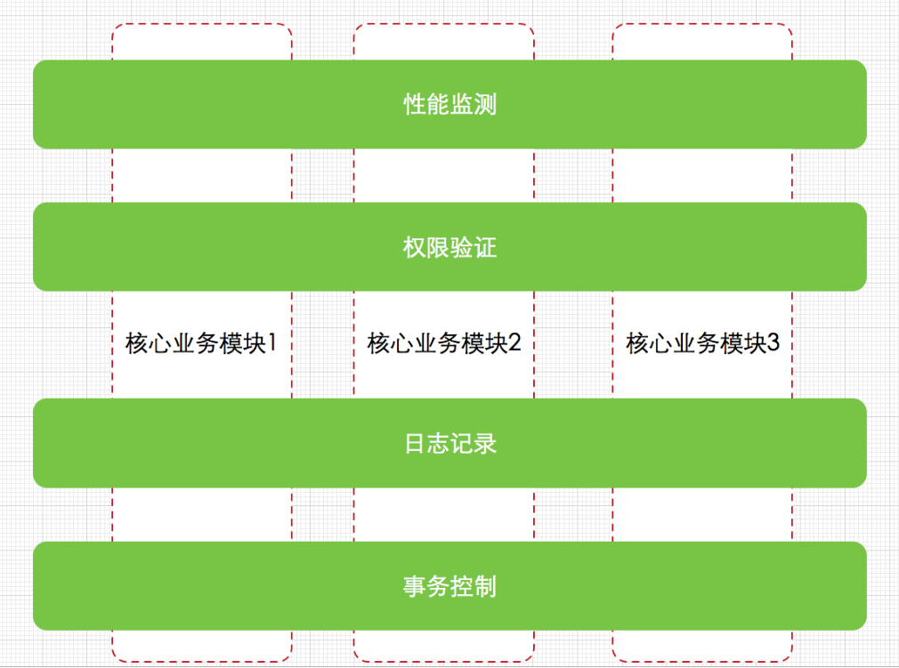
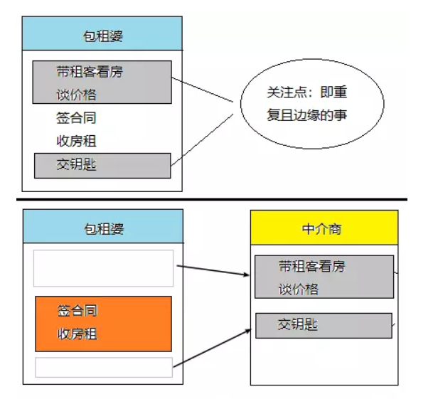
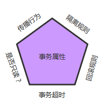

# Spring
Spring 是模块化的，允许你挑选和选择适用于你的模块，不必要把剩余部分也引入。下面的部分对在 Spring 框架中所有可用的模块给出了详细的介绍。    
   
核心容器由spring-core，spring-beans，spring-context，spring-context-support和spring-expression（SpEL，Spring表达式语言，Spring Expression Language）等模块组成。  
spring-core模块提供了框架的基本组成部分，包括 IoC 和依赖注入功能  
spring-beans 模块提供 BeanFactory，工厂模式的微妙实现，它移除了编码式单例的需要，并且可以把配置和依赖从实际编码逻辑中解耦。    
context模块建立在由core和 beans 模块的基础上建立起来的，它以一种类似于JNDI注册的方式访问对象。Context模块继承自Bean模块，并且添加了国际化（比如，使用资源束）、事件传播、资源加载和透明地创建上下文（比如，通过Servelet容器）等功能。    
spring-expression模块提供了强大的表达式语言，用于在运行时查询和操作对象图。支持set和get属性值、属性赋值、方法调用、访问数组集合及索引的内容、逻辑算术运算、命名变量、通过名字从Spring IoC容器检索对象，还支持列表的投影、选择以及聚合等。  

它们的完整依赖关系如下图所示：  
    

数据访问/集成：数据访问/集成层包括 JDBC，ORM，OXM，JMS 和事务处理模块  
Web：Web 层由 Web，Web-MVC，Web-Socket 和 Web-Portlet 组成  
其他：还有其他一些重要的模块，像 AOP，Aspects，Instrumentation，Messaging和测试模块  

## 环境配置
	<dependency>
	  <groupId>org.springframework</groupId>
	  <artifactId>spring-beans</artifactId>
	  <version>5.2.1.RELEASE</version>
	</dependency>
	<dependency>
	  <groupId>org.springframework</groupId>
	  <artifactId>spring-context</artifactId>
	  <version>5.2.1.RELEASE</version>
	</dependency>
	<!-- https://mvnrepository.com/artifact/org.springframework/spring-core -->
	<dependency>
	  <groupId>org.springframework</groupId>
	  <artifactId>spring-core</artifactId>
	  <version>5.2.1.RELEASE</version>
	</dependency>
	<dependency>
	  <groupId>org.springframework</groupId>
	  <artifactId>spring-expression</artifactId>
	  <version>5.2.1.RELEASE</version>
	</dependency>
	<!-- https://mvnrepository.com/artifact/commons-logging/commons-logging -->
	<dependency>
	  <groupId>commons-logging</groupId>
	  <artifactId>commons-logging</artifactId>
	  <version>1.1.1</version>
	</dependency>
	<!-- https://mvnrepository.com/artifact/log4j/log4j -->
	<dependency>
	  <groupId>log4j</groupId>
	  <artifactId>log4j</artifactId>
	  <version>1.2.17</version>
	</dependency>

## IoC 容器
Spring 容器是 Spring 框架的核心。容器将创建对象，把它们连接在一起，配置它们，并管理他们的整个生命周期从创建到销毁。   
Spring 容器使用依赖注入（DI）来管理组成一个应用程序的组件。  
IOC 容器具有依赖注入功能的容器，它可以创建对象，IOC 容器负责实例化、定位、配置应用程序中的对象及建立这些对象间的依赖。通常new一个实例，控制权由程序员控制，而"控制反转"是指new实例工作不由程序员来做而是交给Spring容器来做。在Spring中BeanFactory是IOC容器的实际代表者。  
**Spring BeanFactory 容器**：它是最简单的容器，给 DI 提供了基本的支持，它用 org.springframework.beans.factory.BeanFactory 接口来定义。BeanFactory 仍然可以用于轻量级的应用程序，如移动设备或基于 applet 的应用程序，其中它的数据量和速度是显著。      
**Spring ApplicationContext 容器**：ApplicationContext 容器包括 BeanFactory 容器的所有功能，添加了更多的企业特定的功能，例如从一个属性文件中解析文本信息的能力，发布应用程序事件给感兴趣的事件监听器的能力。该容器是由 org.springframework.context.ApplicationContext 接口定义。    

### BeanFactory 容器
BeanFactory是一个最简单的容器，它主要的功能是为依赖注入 （DI） 提供支持，在 Spring 中，有大量对 BeanFactory 接口的实现。其中，最常被使用的是 XmlBeanFactory 类。这个容器从一个 XML 文件中读取配置元数据，由这些元数据来生成一个被配置化的系统或者应用。   
在资源宝贵的移动设备或者基于 applet 的应用当中， BeanFactory 会被优先选择。否则，一般使用的是 ApplicationContext，除非你有更好的理由选择 BeanFactory。   

	//利用框架提供的 XmlBeanFactory() API 去生成工厂 bean 
	//以及利用 ClassPathResource() API 去加载在路径 CLASSPATH 下可用的 bean 配置文件。
	XmlBeanFactory factory = new XmlBeanFactory(new ClassPathResource("application.xml"));
	//利用第一步生成的 bean 工厂对象的 getBean() 方法得到所需要的 bean。 
	//这个方法通过配置文件中的 bean ID 来返回一个真正的对象，该对象最后可以用于实际的对象。一旦得到这个对象，你就可以利用这个对象来调用任何方法
	IService iService = (IService) factory.getBean("IService");
	iService.doSome();

### ApplicationContext 容器
Application Context 是 BeanFactory 的子接口，也被成为 Spring 上下文。  
Application Context 是 spring 中较高级的容器。和 BeanFactory 类似，它可以加载配置文件中定义的 bean，将所有的 bean 集中在一起，当有请求的时候分配 bean。 另外，它增加了企业所需要的功能，比如，从属性文件中解析文本信息和将事件传递给所指定的监听器。这个容器在 org.springframework.context.ApplicationContext interface 接口中定义。  
ApplicationContext 包含 BeanFactory 所有的功能，一般情况下，相对于 BeanFactory，ApplicationContext 会更加优秀。当然，BeanFactory 仍可以在轻量级应用中使用，比如移动设备或者基于 applet 的应用程序。  
最常被使用的 ApplicationContext 接口实现：  
* FileSystemXmlApplicationContext：该容器从 XML 文件中加载已被定义的 bean。在这里，你需要提供给构造器 XML 文件的完整路径。  
* ClassPathXmlApplicationContext：该容器从 XML 文件中加载已被定义的 bean。在这里，你不需要提供 XML 文件的完整路径，只需正确配置 CLASSPATH 环境变量即可，因为，容器会从 CLASSPATH 中搜索 bean 配置文件。  
* WebXmlApplicationContext：该容器会在一个 web 应用程序的范围内加载在 XML 文件中已被定义的 bean。   

		//读取配置文件，加载里面的配置等
		ApplicationContext context = new FileSystemXmlApplicationContext
            ("C:/Users/zack/workspace/HelloSpring/src/application.xml");
        ApplicationContext applicationContext = new ClassPathXmlApplicationContext("application.xml");
        //通过getBean得到对象，其中IService就是我们刚刚在application.xml中配置的<bean/>中的id
        IService iService = (IService) applicationContext.getBean("IService");
        //得到对象，便执行其方法
        iService.doSome();

## Bean
bean 是一个被实例化，组装，并通过 Spring IoC 容器所管理的对象，是由用容器提供的配置元数据创建的  

**Bean 与 Spring 容器的关系**：  
    

Spring IoC 容器完全由实际编写的配置元数据的格式解耦。有下面三种方法把配置元数据提供给 Spring 容器：  
* 基于 XML 的配置文件  
* 基于注解的配置  
* 基于 Java 的配置    

### 基于 XML 的配置文件  
	<!--User 类通过构造函数实例化-->
	<bean id="user01" class="com.hs.model.User">
	   <!--index=""(可以省略)是设置参数的索引(0开始)，是第几个 type可以不用写
	        name就是构造函数的参数值，value就是赋的值
		-->
	   <!--翻译constructor：构造函数-->
	   <constructor-arg name="user_id" value="100" index="0" type="java.lang.Integer"/>
	   <constructor-arg name="user_name" index="1">
	      <value>悟空</value>  <!--上面是简写-->
	      <!--设置空是<null/>-->
	   </constructor-arg>
	</bean>


	<!--构造函数实例化数组，list，set-->
	<bean id="user02" class="com.hs.model.User">
	   <constructor-arg name="user_name" value="八戒" index="0"/>
	   <constructor-arg name="user_id" value="200" index="1"/>
	   <constructor-arg name="hobbyArray" index="2">
	      <array>
	         <value>篮球</value>
	         <value>足球</value>
	         <value>看书</value>
	         <value>音乐</value>
	      </array>
	   </constructor-arg>
	   <constructor-arg name="hobbyList">
	      <list>
	         <value>篮球</value>
	         <value>足球</value>
	         <value>看书</value>
	         <value>音乐</value>
	      </list>
	   </constructor-arg>
	   <constructor-arg name="hobbySet">
	      <set>
	         <value>篮球</value>
	         <value>足球</value>
	         <value>看书</value>
	         <value>音乐</value>
	      </set>
	   </constructor-arg>
	</bean>    


	<!--构造函数实例化Map，Properties-->
	<bean id="user03" class="com.hs.model.User">
	   <constructor-arg name="map">
	      <map>
	         <entry key="hs">
	            <value>和尚</value>
	         </entry>
	         <!--缩写-->
	         <entry key="name" value="悟空"/>
	      </map>
	   </constructor-arg>
	   <constructor-arg name="properties">
	      <props>
	         <!--给Properties赋值-->
	         <prop key="age">100</prop>
	         <prop key="RuntimeExceiption">error</prop>
	      </props>
	   </constructor-arg>
	</bean>


	<!--构造函数初始化自定义类型-->
	<bean id="user04" class="com.hs.model.User">
	   <constructor-arg name="hsRole">
	      <bean id="role1" class="com.hs.model.Role"/>
	   </constructor-arg>
	</bean>


​	
​	<!--构造函数实例化自定义类型-->
​	<bean id="user05" class="com.hs.model.User">
​	   <constructor-arg name="hsRole">
​	      <bean class="com.hs.model.Role">
​	         <constructor-arg name="role_name" value="超级管理员"/>
​	      </bean>
​	   </constructor-arg>
​	</bean>
​	
​	<!--构造函数实例化自定义类型——推荐引用方式-->
​	<bean id="user06" class="com.hs.model.User">
​	   <constructor-arg name="hsRole" ref="role2"/>
​	</bean>
​	<bean id="role2" class="com.hs.model.Role">
​	   <constructor-arg name="role_name" value="引用方式推荐"/>
​	</bean>  


## 控制反转(IoC) 
IOC是Inversion of Control的缩写。  
1996年，Michael Mattson在一篇有关探讨面向对象框架的文章中，首先提出了IOC 这个概念。  
IOC理论提出的观点大体是这样的：借助于“第三方”实现具有依赖关系的对象之间的解耦。  

**依赖**： 如果在 Class A 中，有 Class B 的实例，则称 Class A 对 Class B 有一个依赖。

在采用面向对象方法设计的软件系统中，它的底层实现都是由N个对象组成的，所有的对象通过彼此的合作，最终实现系统的业务逻辑。  

软件系统在没有引入IOC容器之前，对象A依赖于对象B，那么对象A在初始化或者运行到某一点的时候，自己必须主动去创建对象B或者使用已经创建的对象B。无论是创建还是使用对象B，控制权都在自己手上。  
软件系统在引入IOC容器之后，这种情形就完全改变了，由于IOC容器的加入，对象A与对象B之间失去了直接联系，所以，当对象A运行到需要对象B的时候，IOC容器会主动创建一个对象B注入到对象A需要的地方。  
通过前后的对比，我们不难看出来：对象A获得依赖对象B的过程,由主动行为变为了被动行为，控制权颠倒过来了，这就是“控制反转”这个名称的由来。    

**IOC的别名：依赖注入(DI) **  
2004年，Martin Fowler探讨了同一个问题，既然IOC是控制反转，那么到底是“哪些方面的控制被反转了呢？”，经过详细地分析和论证后，他得出了答案：“获得依赖对象的过程被反转了”。控制被反转之后，获得依赖对象的过程由自身管理变为了由IOC容器主动注入。于是，他给“控制反转”取了一个更合适的名字叫做“依赖注入（Dependency Injection）”。  
他的这个答案，实际上给出了实现IOC的方法：注入。所谓依赖注入，就是由IOC容器在运行期间，动态地将某种依赖关系注入到对象之中。    
所以，依赖注入(DI)和控制反转(IOC)是从不同的角度的描述的同一件事情，就是指通过引入IOC容器，利用依赖关系注入的方式，实现对象之间的解耦。   

对象A依赖于对象B,当对象 A需要用到对象B的时候，IOC容器就会立即创建一个对象B送给对象A。IOC容器就是一个对象制造工厂，你需要什么，它会给你送去，你直接使用就行了，而再也不用去关心你所用的东西是如何制成的，也不用关心最后是怎么被销毁的，这一切全部由IOC容器包办。   
在传统的实现中，由程序内部代码来控制组件之间的关系。我们经常使用new关键字来实现两个组件之间关系的组合，这种实现方式会造成组件之间耦合。IOC很好地解决了该问题，它将实现组件间关系从程序内部提到外部容器，也就是说由容器在运行期将组件间的某种依赖关系动态注入组件中。  

**IOC为我们带来了什么好处**  
 我们还是从USB的例子说起，使用USB外部设备比使用内置硬盘，到底带来什么好处？
 第一、USB设备作为电脑主机的外部设备，在插入主机之前，与电脑主机没有任何的关系，只有被我们连接在一起之后，两者才发生联系，具有相关性。所以，无论两者中的任何一方出现什么的问题，都不会影响另一方的运行。这种特性体现在软件工程中，就是**可维护性比较好，非常便于进行单元测试，便于调试程序和诊断故障。**代码中的每一个Class都可以单独测试，彼此之间互不影响，只要保证自身的功能无误即可，这就是组件之间低耦合或者无耦合带来的好处。    
 第二、USB设备和电脑主机的之间无关性，还带来了另外一个好处，生产USB设备的厂商和生产电脑主机的厂商完全可以是互不相干的人，各干各事，他们之间唯一需要遵守的就是USB接口标准。这种特性体现在软件开发过程中，好处可是太大了。每个开发团队的成员都只需要关心实现自身的业务逻辑，完全不用去关心其它的人工作进展，因为你的任务跟别人没有任何关系，你的任务可以单独测试，你的任务也不用依赖于别人的组件，再也不用扯不清责任了。所以，在一个大中型项目中，团队成员分工明确、责任明晰，很容易将一个大的任务划分为细小的任务，开发效率和产品质量必将得到大幅度的提高。  
 第三、同一个USB外部设备可以插接到任何支持USB的设备，可以插接到电脑主机，也可以插接到DV机，USB外部设备可以被反复利用。在软件工程中，这种特性就是**可复用性好**，我们可以把具有普遍性的常用组件独立出来，反复利用到项目中的其它部分，或者是其它项目，当然这也是面向对象的基本特征。显然，IOC不仅更好地贯彻了这个原则，提高了模块的可复用性。符合接口标准的实现，都可以插接到支持此标准的模块中。  
 第四、同USB外部设备一样，模块具有热插拔特性。IOC生成对象的方式转为外置方式，也就是把对象生成放在配置文件里进行定义，这样，当我们更换一个实现子类将会变得很简单，只要修改配置文件就可以了，完全**具有热插拨的特性**。  

**IOC容器的技术剖析**  
IOC中最基本的技术就是“反射(Reflection)”编程，目前.Net C#、Java和PHP5等语言均支持，其中PHP5的技术书籍中，有时候也被翻译成“映射”。有关反射的概念和用法，大家应该都很清楚，通俗来讲就是根据给出的类名（字符串方式）来动态地生成对象。这种编程方式可以让对象在生成时才决定到底是哪一种对象。反射的应用是很广泛的，很多的成熟的框架，比如象Java中的hibernate、Spring框架，.Net中 NHibernate、Spring.NET框架都是把“反射”做为最基本的技术手段。  
反射技术其实很早就出现了，但一直被忽略，没有被进一步的利用。当时的反射编程方式相对于正常的对象生成方式要慢至少得10倍。现在的反射技术经过改良优化，已经非常成熟，反射方式生成对象和通常对象生成方式，速度已经相差不大了，大约为1-2倍的差距。  
我们可以把IOC容器的工作模式看做是工厂模式的升华，可以把IOC容器看作是一个工厂，这个工厂里要生产的对象都在配置文件中给出定义，然后利用编程语言的的反射编程，根据配置文件中给出的类名生成相应的对象。从实现来看，IOC是把以前在工厂方法里写死的对象生成代码，改变为由配置文件来定义，也就是把工厂和对象生成这两者独立分隔开来，目的就是提高灵活性和可维护性。

## 依赖注入（Dependency Injection）
Spring框架的核心功能之一就是通过依赖注入的方式来管理Bean之间的依赖关系    
所谓依赖注入，就是由IOC容器在运行期间，动态地将某种依赖关系注入到对象之中。
对象A依赖于对象B,当对象 A需要用到对象B的时候，IOC容器就会立即创建一个对象B送给对象A。IOC容器就是一个对象制造工厂，你需要什么，它会给你送去，你直接使用就行了，而再也不用去关心你所用的东西是如何制成的，也不用关心最后是怎么被销毁的，这一切全部由IOC容器包办。  

### DI示例
依赖 如果在 Class A 中，有 Class B 的实例，则称 Class A 对 Class B 有一个依赖。例如下面类 Human 中用到一个 Father 对象，我们就说类 Human 对类 Father 有一个依赖。  

	public class Human {
	    ...
	    Father father;
	    ...
	    public Human() {
	        father = new Father();
	    }
	}

仔细看这段代码我们会发现存在一些问题：
(1). 如果现在要改变 father 生成方式，如需要用new Father(String name)初始化 father，需要修改 Human 代码；
(2). 如果想测试不同 Father 对象对 Human 的影响很困难，因为 father 的初始化被写死在了 Human 的构造函数中；
(3). 如果new Father()过程非常缓慢，单测时我们希望用已经初始化好的 father 对象 Mock 掉这个过程也很困难。  

依赖注入 上面将依赖在构造函数中直接初始化是一种 Hard init 方式，弊端在于两个类不够独立，不方便测试。我们还有另外一种 Init 方式，如下：  

	public class Human {
	    ...
	    Father father;
	    ...
	    public Human(Father father) {
	        this.father = father;
	    }
	}
上面代码中，我们将 father 对象作为构造函数的一个参数传入。在调用 Human 的构造方法之前外部就已经初始化好了 Father 对象。像这种非自己主动初始化依赖，而通过外部来传入依赖的方式，我们就称为依赖注入。
现在我们发现上面 1 中存在的两个问题都很好解决了，简单的说依赖注入主要有两个好处：
(1). 解耦，将依赖之间解耦。
(2). 因为已经解耦，所以方便做单元测试，尤其是 Mock 测试。  

DI 主要有两种变体：  
1. Constructor-based dependency injection：当容器调用带有多个参数的构造函数类时，实现基于构造函数的 DI，每个代表在其他类中的一个依赖关系。  
2. Setter-based dependency injection：基于 setter 方法的 DI 是通过在调用无参数的构造函数或无参数的静态工厂方法实例化 bean 之后容器调用 beans 的 setter 方法来实现的。    


依赖注入有三种实现方式：
1. 构造函数注入
2. set方法参数注入  
3. 接口注入

基于@Autowired的自动装配，默认是根据类型注入，可以用于构造器、接口、方法注入  
@Resource注解可以标注在字段或属性的setter方法上，但它默认按名称装配。名称可以通过@Resource的name属性指定，当注解标注在字段上，即默认取字段的名称作为bean名称寻找依赖对象，当注解标注在属性的setter方法上，即默认取属性名作为bean名称寻找依赖对象。

### 基于构造函数的依赖注入
通过将@Autowired注解放在构造器上来完成构造器注入，默认构造器参数通过类型自动装配，如下所示：    
调用有参数的构造函数，传入默认值。  

	 public class Test1 {  
	    private MessageInterface message;  
	    @Autowired //构造器注入  
	    private Test1(MessageInterface message) {  
	        this.message = message;    
	    } 
	    //省略getter和setter  
	 }

### 基于接口的依赖注入
通过将@Autowired注解放在构造器上来完成接口注入。    
调用无参数的构造函数，再通过接口回调的方式设置属性值。  

	public class Test2 {  
	    @Autowired //接口注入  
	    private MessageInterface messageInterface;  
	    //省略getter和setter  
	}

### 基于设值函数的依赖注入
通过将@Autowired注解放在方法上来完成方法参数注入。    
实际是先调用无参数构造函数，再通过set方法设置属性值。

	public class Test3 {  
	    private MessageInterface message;  
	 
	    @Autowired //setter方法注入  
	    public void setMessage(MessageInterface message) {  
	        this.message = message;  
	    }  
	    public String getMessage() {  
	        return message;  
	    }  
	}
	
	public class Test4 {  
	    private MessageInterface message;  //
	    private List<String> list;  
	    @Autowired(required = true) //任意一个或多个参数方法注入  
	    private void initMessage(MessageInterface message, ArrayList<String> list) {  
	        this.message = message;  
	        this.list = list;  
	    }  
	    //省略getter和setter  
	} 


## Beans 自动装配
在Spring使用中，我们在xml配置文件通过元素或元素的ref属性向bean注入另外的依赖bean。
如果使用自动装配(autowiring) ，就可以减少甚至消除配置元素和元素。   
设置元素的autowire属性就可以设定bean的自动装配模式。   
自动装配有5种模式:  
1. no:默认设置，不使用自动装配，对于大规模系统，推荐使用，明确的指定依赖易于控制。  
2. byName:通过属性名自动装配，Spring容器看到在XML配置文件中 bean 的自动装配的属性设置为 byName。然后尝试匹配，并且将它的属性名与在配置文件中被定义为相同名称（id属性）的bean进行连接。   
3. byType:由属性数据类型自动装配。Spring 容器看到在 XML 配置文件中 bean 的自动装配的属性设置为 byType。然后如果它的类型匹配配置文件中的一个确切的 bean 名称，它将尝试匹配和连接属性的类型。如果存在不止一个这样的 bean，则抛出一个致命的异常。  
4. constructor:类似于 byType，但该类型适用于构造函数参数类型。如果在容器中不存在与构造函数参数类型相同的bean，则抛出异常。  
5. autodetect：Spring首先尝试通过 constructor 使用自动装配来连接，找不到，Spring 尝试通过 byType 来自动装配。  

### 在xml中使用自动装配
	<!-- user bean的属性account的值是一个定义好的Bean，在属性中通过ref引用其id(ac_100)实现注入 -->
	<bean id="ac_100" class="twm.demo.Account"/>
	<bean id="user" class="twm.demo.User">
	  <property name="username" value="Yanglan"/>
	  <property name="account" ref="ac_100"/>
	</bean>
	
	<!--以下是使用自动装配，假设这里定义的id为account-->
	<!--把该Bean的id改成了与引用它的Bean属性相同的名字(id=”account”)，然后使用byName的方式来自动装配，对user bean来说省略配置一个元素-->
	<bean id="account" class="twm.demo.Account"/>
	<bean id="user" class="twm.demo.User" autowire="byName">
	  <property name="username" value="Yanglan"/>
	</bean>
	
	<!--把autowire属性值改为byType后，在注入account属性时，并不关心bean id了，而是查找容器中是否有类型为twm.demo.Account的bean
	但是如果有多个bean的类型都匹配的情况，那么就会出错，因为byType方式只允许匹配一个类型相同的Bean-->
	<bean id="ac_anyname" class="twm.demo.Account"/>
	<bean id="user" class="twm.demo.User" autowire="byType">
	  <property name="username" value="Yanglan"/>
	</bean>
	
	<!--默认自动装配
	在元素中添加一个default-autowire属性，该配置文件当中的所有bean将会进行自动装配，如果有特定的bean需要使用其他的方式，
	在该bean上直接设置autowire属性就可以了，会覆盖掉默认自动装配的配置-->
	<beans ... default-autowire="byType">
	</beans>

### 使用注解自动装配
在使用注解装配之前，首先要开启注解装配的方式，在配置文件中加上下面这句话  
	
	<!--1.启动Spring注解-->
	<context:annotation-config/>
	<!--2.扫描注解-->
	<context:component-scan base-package="com.demo"/>

自动装配使用一下几个注解：  
@Autowired注解，用于setter方法，构造函数，直接注解在属性(最常用)  
@Qualifier注解，如果在容器中出现了两个适合的bean，就会出错。怎么解决呢？这个时候可以使用@Qualifier注解指定一个Bean来装配，这样就不会报异常了。@Qualifier注解采用的是byName的方式。   
@Value注解，自动装配基本类型的或者是字面值常量的参数，可以使用表达式来动态的计算并装配属性的值    


## 基于注解的配置  
从 Spring 2.5 开始就可以使用注解来配置依赖注入。而不是采用 XML 来描述一个 bean 关联关系，你可以使用相关类，方法或字段声明的注解，将 bean 配置移动到组件类本身。      
如果你想在 Spring 应用程序中使用的任何注解，在配置文件中加入：  

	<context:annotation-config/>

### @Required 注解
@Required 注释应用于 bean 属性的 setter 方法，它表明受影响的 bean 属性在配置时必须放在 XML 配置文件中，否则容器就会抛出一个 BeanInitializationException 异常。  

### @Autowired 注解
@Autowired用于设置bean自动装配  
@Autowired注解可以用在任何方法上，不一定非得是setter方法，只要方法有需要自动装配的参数都可以，但是一般都是使用在setter方法和构造器上的。  
@Autowired注解默认使用的是byType的方式向Bean里面注入相应的Bean。    
使用@Autowired自动装配时，容器中只能有一个适合的Bean待选，否则的话，spring会抛出异常。(因为@Autowired默认是使用byType的方式装配) 如果在应用上下文当中找不到相应的bean去自动装配，那么spring也会抛出异常（NoSuchBeanDefinitionException）。  
如果想避免这种情况发生，而且需要装配的属性也不是必须要装配的话，可以使用如下代码来使用注解：   

	@Autowired(required=false)
	private Instrument instrument; 

### @Qualifier注解
如果在容器中出现了两个适合的bean，就会出错。怎么解决呢？这个时候可以使用@Qualifier注解指定一个Bean来装配，这样就不会报异常了。@Qualifier注解采用的是byName的方式。括号中的字符串标注的是需要自动装配进来的Bean的id 在注解注入中使用表达式     

	@Autowired
	@Qualifier("CellPhoneNotifyserviceImpl")
	private NotifyService notifyservice;  

### @Value注解 
在使用注解自动装配的过程当中，如果想要自动装配基本类型的或者是字面值常量的参数的话，可以是用@Value注解  

	@Value("Messi")
	private String username;

上例为一个String类型的属性装配了一个String类型的值，同样可以装配int，boolean等基本类型的属性。  
在@Value注解中，还可以使用表达式来动态的计算并装配属性的值。(经常用来从properties文件中获取值)比如使用spel表达式从某个对象属性中取得一个值()  

	@Value("#{systemConfig.UploadPath}")
	private String savePath;

为了简化从properties里取配置，可以使用@Value, 可以properties文件中的配置值。在再xml配置文件里引入properties文件，即使给变量赋了初值也会**以配置文件的值为准**。

	<context:property-placeholder location="classpath:test.properties" />

### @Id

数据库主键  

### @GeneratedValue

@GeneratedValue注解存在的意义主要就是为一个实体生成一个唯一标识的主键(JPA要求每一个实体Entity,必须有且只有一个主键),@GeneratedValue提供了主键的生成策略。  

@GeneratedValue注解有两个属性,分别是strategy和generator,其中generator属性的值是一个字符串,默认为"",其声明了主键生成器的名称(对应于同名的主键生成器@SequenceGenerator和@TableGenerator)   

JPA为开发人员提供了四种主键生成策略,其被定义在枚举类GenerationType中,包括  

GenerationType.TABLE,

GenerationType.SEQUENCE,

GenerationType.IDENTITY,主键自增长   

GenerationType.AUTO,在以上三种主键生成策略中选择其中一种

### @Column

数据库列名

```java
@Column(name = "JOINING_DATE", nullable = false)
```

### @Type

定义数据类型

```java
@Column(name = "JOINING_DATE", nullable = false)@Type(type="org.jadira.usertype.dateandtime.joda.PersistentLocalDate")private LocalDate joiningDate;
```

### @Configuration

该类等价 与XML中配置beans，相当于Ioc容器，它的某个方法头上如果注册了@Bean，就会作为这个Spring容器中的Bean，与xml中配置的bean意思一样。    

### @EnableTransactionManagement

is equivalent to Spring’s tx:* XML namespace, enabling Spring’s annotation-driven transaction management capability.

### @ComponentScan

```java
@ComponentScan({"com.demo.configuration"})
```

包扫描路径，等效于xml配置文件中的 `context:component-scan base-package="..."` , 配置在哪个包里去找 spring beans/classes的注解配置.  

### @PropertySource

```java
@PropertySource({"classpath:application.properties"})
```

is used to declare a set of properties(defined in a properties file in application classpath) in Spring run-time `Environment`, providing flexibility to have different values in different application environments.

### @Controller, @Service, @Repository,@Component

4种注解意思是一样，并没有什么区别，区别只是名字不同。  
在类上写注解  

### @PostConstruct 和 @PreDestory   
实现初始化和销毁bean之前进行的操作，只能有一个方法可以用此注释进行注释，方法不能有参数，返回值必需是void,方法需要是非静态的。  

### @Primary
自动装配时当出现多个Bean候选者时，被注解为@Primary的Bean将作为首选者，否则将抛出异常。  

### @Lazy(true)
用于指定该Bean是否取消预初始化，用于注解类，延迟初始化。  

### @Resource
默认按 byName自动注入,如果找不到再按byType找bean,如果还是找不到则抛异常，  
可以手动指定bean,它有2个属性分别是name和type，使用name属性，则使用byName的自动注入，而使用type属性时则使用byType自动注入。  

### @Async
基于@Async标注的方法，称之为异步方法,这个注解用于标注某个方法或某个类里面的所有方法都是需要异步处理的。被注解的方法被调用的时候，会在新线程中执行，而调用它的方法会在原来的线程中执行  
xml配置：

	<!--扫描注解，其中包括@Async -->
	<context:component-scan base-package="com.test"/>
	<!-- 支持异步方法执行, 指定一个缺省的executor给@Async使用-->
	<task:annotation-driven executor="defaultAsyncExecutor"  /> 
	<!—配置一个线程执行器-->
	<task:executor id=" defaultAsyncExecutor "pool-size="100-10000" queue-capacity="10" keep-alive =”5”/>  

### @Named
@Named和Spring的@Component功能相同。@Named可以有值，如果没有值生成的Bean名称默认和类名相同。  

### @Inject  
使用@Inject需要引用javax.inject.jar，它与Spring没有关系，是jsr330规范。   
与@Autowired有互换性。  

### @Singleton
只要在类上加上这个注解，就可以实现一个单例类，不需要自己手动编写单例实现类。   

### @Valid,@Valided
1.@Valid必需使用在以@RequestBody接收参数的情况下。  
2.使用ajax以POST方式提示数据，禁止用Fiddler以及浏览器直接访问的方式测试接口  
3.用<mvc:annotation-driven />添加注解驱动。  
4.@Valid是应用在javabean上的校验。  
5.@Valid下后面紧跟BindingResult result，验证结果保存在result  

### @RequestBody
@RequestBody（required=true）:有个默认属性required,默认是true,当body里没内容时抛异常。
application/x-www-form-urlencoded：窗体数据被编码为名称/值对。这是标准的编码格式。这是默认的方式  
multipart/form-data：窗体数据被编码为一条消息，页上的每个控件对应消息中的一个部分。二进制数据传输方式，主要用于上传文件  
必需使用POST方式提交参数  

### @CrossOrigin
是Cross-Origin ResourceSharing（跨域资源共享）的简写，作用是解决跨域访问的问题，在Spring4.2以上的版本可直接使用。在类上或方法上添加该注解  

### @RequestParam
提取和解析请求中的参数。@RequestParam支持类型转换，类型转换目前支持所有的基本Java类型  
@RequestParam([value=”number”], [required=false])  String number   

### @PathVariable
处理requet uri部分,当使用@RequestMapping URI template 样式映射时， 即someUrl/{paramId}, 这时的paramId可通过 @Pathvariable注解绑定它传过来的值到方法的参数上  

### @RequestHeader，@CookieValue  
处理request header部分的注解，将头部信息绑定到方法参数上  

### @RequestParam,  @RequestBody
处理request body部分的注解  

### @Scope
配置bean的作用域  
默认是单例模式，即@Scope(“singleton”),  
singleton：单例，即容器里只有一个实例对象。  
prototype：多对象，每一次请求都会产生一个新的bean实例  

### @ResponseStatus
@ResponseStatus用于修饰一个类或者一个方法，修饰一个类的时候，一般修饰的是一个异常类,当处理器的方法被调用时，@ResponseStatus指定的code和reason会被返回给前端。value属性是http状态码，比如404，500等。reason是错误信息  
当修改类或方法时，只要该类得到调用，那么value和reason都会被添加到response里  

### @RestController
@RestController = @Controller + @ResponseBody。  
是2个注解的合并效果，即指定了该controller是组件，又指定方法返回的是String或json类型数据，不会解决成jsp页面，注定不够灵活，如果一个Controller即有SpringMVC返回视图的方法，又有返回json数据的方法即使用@RestController太死板。  
灵活的作法是：定义controller的时候，直接使用@Controller，如果需要返回json可以直接在方法中添加@ResponseBody   

### @ControllerAdvice  
把@ControllerAdvice注解内部使用@ExceptionHandler、@InitBinder、@ModelAttribute注解的方法应用到所有的 @RequestMapping注解的方法。非常简单，不过只有当使用@ExceptionHandler最有用，另外两个用处不大。     

### 元注解 @Retention @Target @Document @Inherited  
元注解是指注解的注解  
@Retention(RetentionPolicy.SOURCE)   //注解仅存在于源码中，在class字节码文件中不包含  
@Retention(RetentionPolicy.CLASS)     //默认的保留策略，注解会在class字节码文件中存在，但运行时无法获得，  
@Retention(RetentionPolicy.RUNTIME)  //注解会在class字节码文件中存在，在运行时可以通过反射获取到  
@Target(ElementType.TYPE)   //接口、类、枚举、注解   
@Target(ElementType.FIELD) //字段、枚举的常量  
@Target(ElementType.METHOD) //方法  
@Target(ElementType.PARAMETER) //方法参数  
@Target(ElementType.CONSTRUCTOR)  //构造函数  
@Target(ElementType.LOCAL_VARIABLE)//局部变量  
@Target(ElementType.ANNOTATION_TYPE)//注解  
@Target(ElementType.PACKAGE) ///包     
@Document：说明该注解将被包含在javadoc中  
@Inherited：说明子类可以继承父类中的该注解  

### @RequestMapping
处理映射请求的注解。用于类上，表示类中的所有响应请求的方法都是以该地址作为父路径。   

### @GetMapping和@PostMapping
@GetMapping(value = “page”)等价于@RequestMapping(value = “page”, method = RequestMethod.GET)    
@PostMapping(value = “page”)等价于@RequestMapping(value = “page”, method = RequestMethod.POST)     

### @Api   
用在类上，说明该类的作用。可以标记一个Controller类做为swagger 文档资源，使用方式：  

	@Api(value = "/user", description = "Operations about user")  

与Controller注解并列使用。 属性配置：  
value                  :url的路径值  
tags                   :如果设置这个值、value的值会被覆盖  
description            :对api资源的描述  
basePath               :基本路径可以不配置  
position               :如果配置多个Api 想改变显示的顺序位置  
produces               :For example, "application/json, application/xml"  
consumes               :For example, "application/json, application/xml"  
protocols              :Possible values: http, https, ws, wss.  
authorizations         :高级特性认证时配置  
hidden                 :配置为true 将在文档中隐藏     

### @ApiParam   
用在方法上，说明方法的作用，每一个url资源的定义,使用方式：  

	@ApiOperation(
	      value = "Find purchase order by ID",
	      notes = "For valid response try integer IDs with value <= 5 or > 10. Other values will generated exceptions",
	      response = Order,
	      tags = {"Pet Store"})

与Controller中的方法并列使用。  
value                   :url的路径值   
tags                    :如果设置这个值、value的值会被覆盖  
description             :对api资源的描述   
basePath                :基本路径可以不配置  
position                :如果配置多个Api 想改变显示的顺序位置  
produces                :For example, "application/json, application/xml"  
consumes                :For example, "application/json, application/xml"  
protocols               :Possible values: http, https, ws, wss.  
authorizations          :高级特性认证时配置  
hidden                  :配置为true 将在文档中隐藏  
response                :返回的对象  
responseContainer       :这些对象是有效的 "List", "Set" or "Map".，其他无效  
httpMethod              :"GET", "HEAD", "POST", "PUT", "DELETE", "OPTIONS" and "PATCH"  
code                    :http的状态码 默认 200  
extensions              :扩展属性  

### @ApiParam
请求属性

	public ResponseEntity<User> createUser(
	            @RequestBody
	            @ApiParam(value = "Created user object", required = true)
	            User user)   

与Controller中的方法并列使用。  
name                    :属性名称  
value                   :属性值  
defaultValue            :默认属性值  
allowableValues         :可以不配置  
required                :是否属性必填  
access                  :不过多描述  
allowMultiple           :默认为false  
hidden                  :隐藏该属性  
example                 :举例子    

### @ApiResponse
响应配置    

	public ResponseEntity<User> createUser(
	        @RequestBody
	        @ApiParam(value = "Created user object", required = true)
	        User user
	        )  

与Controller中的方法并列使用。  
name                    :属性名称  
value                   :属性值  
defaultValue            :默认属性值  
allowableValues         :可以不配置  
required                :是否属性必填  
access                  :不过多描述  
allowMultiple           :默认为false  
hidden                  :隐藏该属性  
example                 :举例子    

### @ApiResponse
响应配置  

	@ApiResponses({ @ApiResponse(code = 400, message = "Invalid Order") }) 

与Controller中的方法并列使用。 属性配置：  
code                     :http的状态码  
message                  :描述  
response                 :默认响应类 Void  
reference                :参考ApiOperation中配置  
responseHeaders          :参考 ResponseHeader 属性配置说明  
responseContainer        :参考ApiOperation中配置      

### @ApiResponses
响应集配置  

	@ApiResponses({ @ApiResponse(code = 400, message = "Invalid Order") })  

与Controller中的方法并列使用。 属性配置：  
value                 :多个ApiResponse配置  

### @ResponseHeader
响应头设置   

	@ResponseHeader(name="head1",description="response head conf")  

与Controller中的方法并列使用。 属性配置：  
name                 :响应头名称
description          :头描述
response             :默认响应类 Void
responseContainer    :参考ApiOperation中配置  

### @ApiImplicitParams
用在方法上包含一组参数说明  

### @ApiImplicitParam
用在@ApiImplicitParams注解中，指定一个请求参数的各个方面    
paramType：参数类型quary,form  
name：参数名称  
value：参数描述  
dataType： 参数数据类型，有String/int，无用  
required ： 是否必要  
defaultValue：参数的默认值  

### @ApiModel
描述一个Model的信息（这种一般用在post创建的时候，使用@RequestBody这样的场景，请求参数无法使用@ApiImplicitParam注解进行描述的时候；  
value–表示对象名   
description–描述     
都可省略   

### @ApiModelProperty   
用于方法，字段； 表示对model属性的说明或者数据操作更改     
描述一个model的属性。   
value–字段说明   
name–重写属性名字   
dataType–重写属性类型   
required–是否必填   
example–举例说明   
hidden–隐藏    

###  @ApiIgnore
用于类，方法，方法参数,表示这个方法或者类被忽略    

### @supperssWarning
jdk内置的三种注解中一种，抑制编译器警告  
另外两种为
@Override，表示重载  
@Deprecated，可以加到类上、方法或者属性上。表示标识的对象已经过期  

### 元注解  
元数据就是用来定义数格式的数据。元注解就用来定义注解的注解，元注解一般加在注解上  
@Target，标识该声明的注解可以用到哪些地方，可以加到类上，或者方法上或者属性上等等  
@Retention，标注该注解的保存级别。有三个保存级别可以使用，source级别（.java）class级别runtime级别（不光保存到class中，在程序运行的时候可以获得到这个注解）默认是class级别  

## AOP
AOP 即 Aspect Oriented Program 面向切面编程 。   

AOP 的目的：  

AOP能够将那些与业务无关，**却为业务模块所共同调用的逻辑或责任（例如事务处理、日志管理、权限控制等）封装起来**，便于**减少系统的重复代码**，**降低模块间的耦合度**，并**有利于未来的可拓展性和可维护性**。    



在面向切面编程的思想里面，把功能分为核心业务功能，和周边功能。  

- **所谓的核心业务**，比如登陆，增加数据，删除数据都叫核心业务  
- **所谓的周边功能**，比如性能统计，日志，事务管理等等  

周边功能在 Spring 的面向切面编程AOP思想里，即被定义为切面  。  


AOP 当中的概念：  

切入点（Pointcut）： 在哪些类，哪些方法上切入（**where**）  

通知（Advice）： 在方法执行的什么实际（**when:**方法前/方法后/方法前后）做什么（**what:**增强的功能）  

切面（Aspect）： 切面 = 切入点 + 通知，通俗点就是：**在什么时机，什么地方，做什么增强！**  

织入（Weaving）： 把切面加入到对象，并创建出代理对象的过程。（由 Spring 来完成）    


现实中的例子：   

   

在上面的例子中，包租婆的核心业务就是签合同，收房租，那么这就够了，灰色框起来的部分都是重复且边缘的事，交给中介商就好了，这就是 **AOP 的一个思想：让关注点代码与业务代码分离！**  


### 使用注解来开发 Spring AOP 


1. 选择连接点

Spring 是方法级别的 AOP 框架，我们主要也是以某个类额某个方法作为连接点，另一种说法就是：**选择哪一个类的哪一方法用以增强功能。**  

```java
package pojo;

import org.springframework.stereotype.Component;

@Component("landlord")
public class Landlord {

    public void service() {
        // 仅仅只是实现了核心的业务功能
        System.out.println("签合同");
        System.out.println("收房租");
    }
}
```

我们在这里就选择上述 Landlord 类中的 service() 方法作为连接点。  

2. 创建切面

选择好了连接点就可以创建切面了，我们可以把切面理解为一个拦截器，当程序运行到连接点的时候，被拦截下来，在开头加入了初始化的方法，在结尾也加入了销毁的方法而已，在 Spring 中只要使用 `@Aspect` 注解一个类，那么 Spring IoC 容器就会认为这是一个切面了：   

```java
package aspect;

import org.aspectj.lang.annotation.After;
import org.aspectj.lang.annotation.Aspect;
import org.aspectj.lang.annotation.Before;
import org.springframework.stereotype.Component;

@Component
@Aspect
class Broker {

    @Before("execution(* pojo.Landlord.service())")
    public void before(){
        System.out.println("带租客看房");
        System.out.println("谈价格");
    }

    @After("execution(* pojo.Landlord.service())")
    public void after(){
        System.out.println("交钥匙");
    }
}
```

- **注意：** 被定义为切面的类仍然是一个 Bean ，需要 `@Component` 注解标注

Spring 中的 AspectJ 注解：  

`@Before` 前置通知，在连接点方法前调用    

`@Around` 环绕通知，它将覆盖原有方法，但是允许你通过反射调用原有方法  

 `@After` 后置通知，在连接点方法后调用   

 `@AfterReturning` 返回通知，在连接点方法执行并正常返回后调用，要求连接点方法在执行过程中没有发生异常    

`@AfterThrowing` 异常通知，当连接点方法异常时调用  


3. 定义切点

在上面的注解中定义了 execution 的正则表达式，Spring 通过这个正则表达式判断具体要拦截的是哪一个类的哪一个方法：  

```java
execution(* pojo.Landlord.service())  
```

- execution：代表执行方法的时候会触发
- `*` ：代表任意返回类型的方法
- pojo.Landlord：代表类的全限定名
- service()：被拦截的方法名称  

通过上面的表达式，Spring 就会知道应该拦截 pojo.Lnadlord 类下的 service() 方法。上面的演示类还好，如果多出都需要写这样的表达式难免会有些复杂，我们可以通过使用 `@Pointcut` 注解来定义一个切点来避免这样的麻烦：

```java
package aspect;

import org.aspectj.lang.annotation.After;
import org.aspectj.lang.annotation.Aspect;
import org.aspectj.lang.annotation.Before;
import org.aspectj.lang.annotation.Pointcut;
import org.springframework.stereotype.Component;

@Component
@Aspect
class Broker {

    @Pointcut("execution(* pojo.Landlord.service())")
    public void lService() {
    }

    @Before("lService()")
    public void before() {
        System.out.println("带租客看房");
        System.out.println("谈价格");
    }

    @After("lService()")
    public void after() {
        System.out.println("交钥匙");
    }
}
```

4. 测试 AOP  

```jade
package test;

import org.springframework.context.ApplicationContext;
import org.springframework.context.support.ClassPathXmlApplicationContext;
import pojo.Landlord;

public class TestSpring {

    public static void main(String[] args) {

        ApplicationContext context =
                new ClassPathXmlApplicationContext("applicationContext.xml");
        Landlord landlord = (Landlord) context.getBean("landlord", Landlord.class);
        landlord.service();

    }
}
```

**@Around  环绕通知   **   

我们来探讨一下环绕通知，这是 Spring AOP 中最强大的通知，因为它集成了前置通知和后置通知，它保留了连接点原有的方法的功能，所以它及强大又灵活，让我们来看看：  

```java
package aspect;

import org.aspectj.lang.ProceedingJoinPoint;
import org.aspectj.lang.annotation.Around;
import org.aspectj.lang.annotation.Aspect;
import org.springframework.stereotype.Component;

@Component
@Aspect
class Broker {
    //  使用 @Around 注解来同时完成前置和后置通知
    @Around("execution(* pojo.Landlord.service())")
    public void around(ProceedingJoinPoint joinPoint) {
        System.out.println("带租客看房");
        System.out.println("谈价格");

        try {
            joinPoint.proceed();
        } catch (Throwable throwable) {
            throwable.printStackTrace();
        }

        System.out.println("交钥匙");
    }
}
```

运行测试代码，结果仍然正确:

> 带租客看房
>
> 谈价格
>
> 签合同
>
> 收房租
>
> 交钥匙

### 使用 XML 配置开发 Spring AOP

| AOP 配置元素        | 用途                             | 备注                       |
| ------------------- | -------------------------------- | -------------------------- |
| aop:advisor         | 定义 AOP 的通知其                | 一种很古老的方式，很少使用 |
| aop:aspect          | 定义一个切面                     |                            |
| aop:before          | 定义前置通知                     |                            |
| aop:after           | 定义后置通知                     |                            |
| aop:around          | 定义环绕通知                     |                            |
| aop:after-returning | 定义返回通知                     |                            |
| aop:after-throwing  | 定义异常通知                     |                            |
| aop:config          | 顶层的 AOP 配置元素              | AOP 的配置是以它为开始的   |
| aop:declare-parents | 给通知引入新的额外接口，增强功能 |                            |
| aop:pointcut        | 定义切点                         |                            |

将上面的例子改写成 XML 配置  （去掉所有的注解）  

```xml
<!-- 装配 Bean-->
<bean name="landlord" class="pojo.Landlord"/>
<bean id="broker" class="aspect.Broker"/>

<!-- 配置AOP -->
<aop:config>
    <!-- where：在哪些地方（包.类.方法）做增加 -->
    <aop:pointcut id="landlordPoint"
                  expression="execution(* pojo.Landlord.service())"/>
    <!-- what:做什么增强 -->
    <aop:aspect id="logAspect" ref="broker">
        <!-- when:在什么时机（方法前/后/前后） -->
        <aop:around pointcut-ref="landlordPoint" method="around"/>
    </aop:aspect>
</aop:config>
```


## 事务管理

数据库事务是一个被视为单一的工作单元的操作序列。这些操作应该要么完整地执行，要么完全不执行。  

事务的概念可以描述为具有以下四个关键属性说成是 **ACID**：  

- **原子性：**事务应该当作一个单独单元的操作，这意味着整个序列操作要么是成功，要么是失败的。
- **一致性：**这表示数据库的引用完整性的一致性，表中唯一的主键等。
- **隔离性：**可能同时处理很多有相同的数据集的事务，每个事务应该与其他事务隔离，以防止数据损坏。
- **持久性：**一个事务一旦完成全部操作后，这个事务的结果必须是永久性的，不能因系统故障而从数据库中删除。  

### Spring事务管理涉及的接口:    

  


**PlatformTransactionManager  事务管理器**     

Spring事务管理器的接口是org.springframework.transaction.PlatformTransactionManager，如上图所示，Spring并不直接管理事务，通过这个接口，Spring为各个平台如JDBC、Hibernate等都提供了对应的事务管理器，也就是将事务管理的职责委托给Hibernate或者JTA等持久化机制所提供的相关平台框架的事务来实现。    

TransactionStatus getTransaction(TransactionDefinition definition) ，事务管理器 通过TransactionDefinition，获得“事务状态”，从而管理事务。    

void commit(TransactionStatus status) 根据状态提交   

void rollback(TransactionStatus status) 根据状态回滚  

也就是说Spring事务管理的为不同的事务API提供一致的编程模型，具体的事务管理机制由对应各个平台去实现。  

**TransactionStatus　事务状态**   

PlatformTransactionManager接口的getTransaction方法返回的是 TransactionStatus对象，然后程序根据返回的对象来获取事务状态，然后进行相应的操作 。   

TransactionStatus接口描述的是一些处理事务提供简单的控制事务执行和查询事务状态的方法，在回滚或提交的时候需要应用对应的事务状态。   

**TransactionDefinition　基本事务属性的定义**   

事务管理器接口PlatformTransactionManager通过getTransaction(TransactionDefinition definition)方法来得到事务，这个方法里面的参数是TransactionDefinition类，这个类就定义了一些基本的事务属性。    

事务属性包含了5个方面，如图所示：  

  

**传播行为：当事务方法被另一个事务方法调用时，必须指定事务应该如何传播**  

Spring 定义了如下七中传播行为，这里以A业务和B业务之间如何传播事务为例说明：  

**PROPAGATION_REQUIRED** ：required , 必须。默认值，A如果有事务，B将使用该事务；如果A没有事务，B将创建一个新的事务。  

PROPAGATION_SUPPORTS：supports ，支持。A如果有事务，B将使用该事务；如果A没有事务，B将以非事务执行。   

PROPAGATION_MANDATORY：mandatory ，强制。A如果有事务，B将使用该事务；如果A没有事务，B将抛异常。  

**PROPAGATION_REQUIRES_NEW** ：requires_new，必须新的。如果A有事务，将A的事务挂起，B创建一个新的事务；如果A没有事务，B创建一个新的事务。   

PROPAGATION_NOT_SUPPORTED ：not_supported ,不支持。如果A有事务，将A的事务挂起，B将以非事务执行；如果A没有事务，B将以非事务执行。  

PROPAGATION_NEVER ：never，从不。如果A有事务，B将抛异常；如果A没有事务，B将以非事务执行。   

**PROPAGATION_NESTED** ：nested ，嵌套。A和B底层采用保存点机制，形成嵌套事务。   

**隔离级别：定义了一个事务可能受其他并发事务影响的程度。**   

**并发事务引起的问题：**在典型的应用程序中，多个事务并发运行，经常会操作相同的数据来完成各自的任务。并发虽然是必须的，但可能会导致以下的问题。  

脏读（Dirty reads）——脏读发生在一个事务读取了另一个事务改写但尚未提交的数据时。如果改写在稍后被回滚了，那么第一个事务获取的数据就是无效的。   

不可重复读（Nonrepeatable read）——不可重复读发生在一个事务执行相同的查询两次或两次以上，但是每次都得到不同的数据时。这通常是因为另一个并发事务在两次查询期间进行了更新。(**重点是修改**)      

幻读（Phantom read）——幻读与不可重复读类似。它发生在一个事务（T1）读取了几行数据，接着另一个并发事务（T2）插入了一些数据时。在随后的查询中，第一个事务（T1）就会发现多了一些原本不存在的记录。   (**重点是新增或删除**)  

在 Spring 事务管理中，为我们定义了如下的隔离级别：  

SOLATION_DEFAULT：使用后端数据库默认的隔离级别  

ISOLATION_READ_UNCOMMITTED：最低的隔离级别，允许读取尚未提交的数据变更，可能会导致脏读、幻读或不可重复读  

ISOLATION_READ_COMMITTED：允许读取并发事务已经提交的数据，可以阻止脏读，但是幻读或不可重复读仍有可能发生    

ISOLATION_REPEATABLE_READ：对同一字段的多次读取结果都是一致的，除非数据是被本身事务自己所修改，可以阻止脏读和不可重复读，但幻读仍有可能发生   

ISOLATION_SERIALIZABLE：最高的隔离级别，完全服从ACID的隔离级别，确保阻止脏读、不可重复读以及幻读，也是最慢的事务隔离级别，因为它通常是通过完全锁定事务相关的数据库表来实现的    

上面定义的隔离级别，在 Spring 的 TransactionDefinition.class 中也分别用常量 -1,0,1,2,4,8表示    

**只读**   

这是事务的第三个特性，是否为只读事务。如果事务只对后端的数据库进行该操作，数据库可以利用事务的只读特性来进行一些特定的优化。通过将事务设置为只读，你就可以给数据库一个机会，让它应用它认为合适的优化措施。    

**事务超时**  

为了使应用程序很好地运行，事务不能运行太长的时间。因为事务可能涉及对后端数据库的锁定，所以长时间的事务会不必要的占用数据库资源。事务超时就是事务的一个定时器，在特定时间内事务如果没有执行完毕，那么就会自动回滚，而不是一直等待其结束。    

**回滚规则**     

事务五边形的最后一个方面是一组规则，这些规则定义了哪些异常会导致事务回滚而哪些不会。默认情况下，事务只有遇到运行期异常时才会回滚，而在遇到检查型异常时不会回滚（这一行为与EJB的回滚行为是一致的） 。但是你可以声明事务在遇到特定的检查型异常时像遇到运行期异常那样回滚。同样，你还可以声明事务遇到特定的异常不回滚，即使这些异常是运行期异常。   


### Spring 支持编程式和声明式事务管理。      

**编程式事务处理**：所谓编程式事务指的是通过编码方式实现事务，允许用户在代码中精确定义事务的边界。即类似于JDBC编程实现事务管理。管理使用TransactionTemplate或者直接使用底层的PlatformTransactionManager。对于编程式事务管理，spring推荐使用TransactionTemplate。  

**声明式事务处理**：管理建立在AOP(切面编程)之上的。其本质是对方法前后进行拦截，然后在目标方法开始之前创建或者加入一个事务，在执行完目标方法之后根据执行情况提交或者回滚事务。声明式事务最大的优点就是不需要通过编程的方式管理事务，这样就不需要在业务逻辑代码中掺杂事务管理的代码，只需在配置文件中做相关的事务规则声明(或通过基于@Transactional注解的方式)，便可以将事务规则应用到业务逻辑中。  

#### 编程式事务处理

bean配置：  

```xml
<!-- 创建模板 -->

<bean id="transactionTemplate" class="org.springframework.transaction.support.TransactionTemplate">
    <property name="transactionManager" ref="txManager"></property>
</bean>
<!-- 配置事务管理器 ,管理器需要事务，事务从Connection获得，连接从连接池DataSource获得 -->
<bean id="txManager" class="org.springframework.jdbc.datasource.DataSourceTransactionManager">
        <property name="dataSource" ref="dataSource"></property>
</bean>
<bean id="dataSource" class="com.mchange.v2.c3p0.ComboPooledDataSource">
    <property name="driverClass" value="com.mysql.jdbc.Driver"></property>
    <property name="jdbcUrl" value="jdbc:mysql://localhost:3306/test"></property>
    <property name="user" value="root"></property>
    <property name="password" value="root"></property>
</bean>
```

service配置：  

```java
//注入事务管理模板
private TransactionTemplate transactionTemplate;
//使用事务
@Override
public void transfer(final String outer,final String inner,final int money) {
     transactionTemplate.execute(new TransactionCallbackWithoutResult() {
     @Override
     protected void doInTransactionWithoutResult(TransactionStatus arg0) {
         accountDao.out(outer, money);
         //int i = 1/0;
         accountDao.in(inner, money);
     }
 });
}
```

#### 声明式事务管理

在applicationContext.xml 配置事务管理器，将并事务管理器交予spring：  

```xml
<!-- 1 事务管理器 -->
<bean id="txManager" class="org.springframework.jdbc.datasource.DataSourceTransactionManager">
    <property name="dataSource" ref="dataSource"></property>
    </bean>
    <!-- 2 将管理器交予spring
        * transaction-manager 配置事务管理器
        * proxy-target-class
          true ： 底层强制使用cglib 代理
    -->
<tx:annotation-driven transaction-manager="txManager" proxy-target-class="true"/>
```

在目标类或目标方法添加注解即可 @Transactional:  

```java
@Transactional(propagation=Propagation.REQUIRED , isolation = Isolation.DEFAULT)
@Service("accountService")  
public class AccountServiceImpl implements AccountService{  
    @Resource(name="accountDao")
    private AccountDao accountDao;
    public void setAccountDao(AccountDao accountDao) {
        this.accountDao = accountDao;
    }
    @Override
    public void transfer(String outer, String inner, int money) {
        accountDao.out(outer, money);
        //int i = 1/0;
        accountDao.in(inner, money);
    }
}
```


​						


编程式事务需要自己写beginTransaction()、commit()、rollback()等事务管理方法，声明式事务是通过注解或配置由spring自动处理，编程式事务粒度更细 


# 参考
https://www.w3cschool.cn/wkspring/by1r1ha2.html    

IoC/DI: 
https://www.cnblogs.com/jhli/p/6019895.html  
https://www.cnblogs.com/sunzhao/p/8334008.html  
注解：  
https://blog.csdn.net/weixin_39805338/article/details/80770472
Swagger常用注解    
https://blog.csdn.net/small_to_large/article/details/77586765  

AOP  

https://www.jianshu.com/p/994027425b44


示例：

http://websystique.com/spring/spring4-hibernate4-mysql-maven-integration-example-using-annotations/