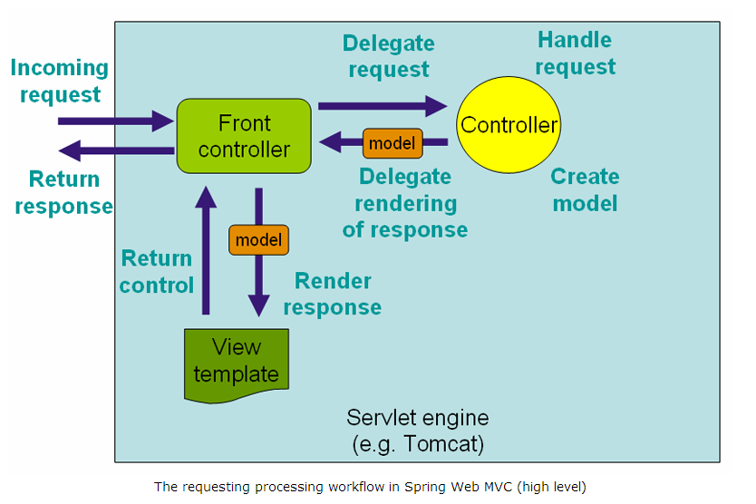
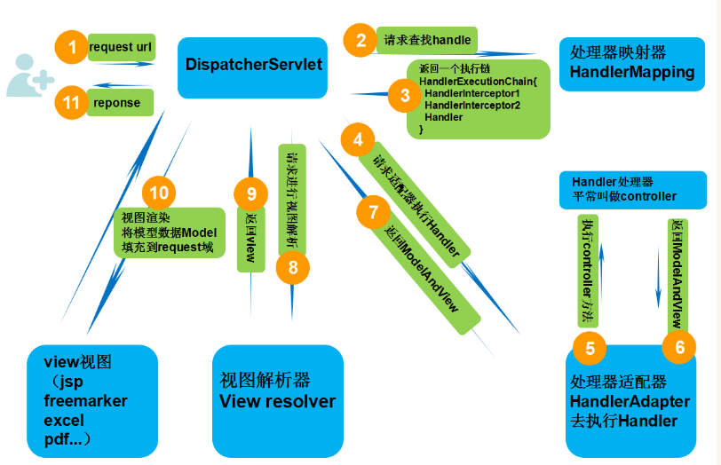
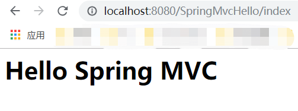

# Spring MVC
Spring Web MVC是在Servlet API上构建的原始Web框架，从一开始就包含在Spring框架中。其正式名称“Spring Web MVC”来自其源模块(Spring -webmvc)的名称，但它更常见的名称是“Spring MVC”。

Spring Web MVC是一种基于Java的实现了Web MVC设计模式的请求驱动类型的轻量级Web框架，使用了MVC架构模式的思想，将web层进行职责解耦。

- 基于请求驱动指的就是使用请求-响应模型
- 框架的目的就是帮助我们简化开发，Spring Web MVC也是要简化我们日常Web开发 

MVC 设计模式代表 Model-View-Controller（模型-视图-控制器） 模式。这种模式用于应用程序的分层开发。  

- **Model（模型）** - 模型代表一个存取数据的对象或 JAVA POJO。它也可以带有逻辑，在数据变化时更新控制器。  
- **View（视图）** - 视图代表**模型**包含的数据的可视化。  
- **Controller（控制器）** - 控制器作用于模型和视图上。它控制数据流向模型对象，并在数据变化时更新视图。它使视图与模型分离开。  

## Spring MVC框架优点

Spring MVC 是 Spring 产品组合的一部分，它享有 Spring IoC容器紧密结合Spring松耦合等特点，因此它有Spring的所有优点。   

1、清晰的角色划分：

　　　　　　　　　 前端控制器（DispatcherServlet）、

　　　　　　　　　 请求到处理器映射（HandlerMapping）、

　　　　　　　　　 处理器适配器（HandlerAdapter）、

　　　　　　　　　 视图解析器（ViewResolver）、

　　　　　　　　　 处理器或页面控制器（Controller）、

　　　　 　　　　　验证器（ Validator）、

　　　　　　　　　 表单对象（Form Object 提供给表单展示和提交到的对象就叫表单对象）。

2、由于命令对象就是一个POJO，无需继承框架特定API，可以使用命令对象直接作为业务对象；

3、和Spring 其他框架无缝集成，是其它Web框架所不具备的；

4、可适配，通过HandlerAdapter可以支持任意的类作为处理器；

5、可定制性，HandlerMapping、ViewResolver等能够非常简单的定制；

6、功能强大的数据验证、格式化、绑定机制；

7、利用Spring提供的Mock对象能够非常简单的进行Web层单元测试；

8、本地化、主题的解析的支持，使我们更容易进行国际化和主题的切换。

9、RESTful风格的支持、简单的文件上传、约定优于配置的契约式编程支持、基于注解的零配置支持等等。

## SpringMVC架构图

  


## SpringMVC框架请求处理流程

  

第一步：发起请求到前端控制器(DispatcherServlet)   

第二步：前端控制器请求HandlerMapping查找 Handler （可以根据xml配置、注解进行查找）  

第三步：处理器映射器HandlerMapping向前端控制器返回Handler，HandlerMapping会把请求映射为HandlerExecutionChain对象(包含一个Handler处理器（页面控制器）对象，多个HandlerInterceptor拦截器对象），通过这种策略模式，很容易添加新的映射策略  

第四步：前端控制器调用处理器适配器去执行Handler   

第五步：处理器适配器HandlerAdapter将会根据适配的结果去执行Handler    

第六步：Handler执行完成给适配器返回ModelAndView  

第七步：处理器适配器向前端控制器返回ModelAndView （ModelAndView是springmvc框架的一个底层对象，包括 Model和view）  

第八步：前端控制器请求视图解析器去进行视图解析 （根据逻辑视图名解析成真正的视图(jsp)），通过这种策略很容易更换其他视图技术，只需要更改视图解析器即可  

第九步：视图解析器向前端控制器返回View   

第十步：前端控制器进行视图渲染 （视图渲染将模型数据(在ModelAndView对象中)填充到request域）  

第十一步：前端控制器向用户响应结果  


## DispatcherServlet

与许多其他web框架一样，Spring MVC也是围绕前端控制器模式设计的，其中一个中央Servlet DispatcherServlet提供了一个用于请求处理的共享算法，而实际工作是由可配置的委托组件执行的。该模型灵活，支持多种工作流程。  

DispatcherServlet 的任务就是拦截请求发送给 Spring MVC Controller。    

与其他Servlet一样，DispatcherServlet需要使用Java配置或web.xml根据Servlet规范声明和映射。然后，DispatcherServlet使用Spring配置来发现请求映射、视图解析、异常处理等所需的委托组件。  

## HandlerMapping

应用程序中可能会有多个控制器，DispatcherServlet 会查询一个或多个处理器映射来确定请求的下一站在哪里，处理器映射会根据请求所携带的 URL 信息来进行决策  

## Controller（控制器）

一旦选择了合适的控制器， DispatcherServlet 会将请求发送给选中的控制器，到了控制器，请求会卸下其负载（用户提交的请求）等待控制器处理完这些信息   

## Model

当控制器在完成逻辑处理后，通常会产生一些信息，这些信息就是需要返回给用户并在浏览器上显示的信息，它们被称为**模型（Model）**     

## View Resolver（视图解析器）

控制器就不会和特定的视图相耦合，传递给 DispatcherServlet 的视图名并不直接表示某个特定的 JSP。（实际上，它甚至不能确定视图就是 JSP）相反，**它传递的仅仅是一个逻辑名称，这个名称将会用来查找产生结果的真正视图。**

DispatcherServlet 将会使用视图解析器（view resolver）来将逻辑视图名匹配为一个特定的视图实现，它可能是也可能不是 JSP

## View

仅仅返回原始的信息是不够的——这些信息需要以用户友好的方式进行格式化，一般会是 HTML，所以，信息需要发送给一个**视图（view）**，通常会是 JSP。    


## @EnableWebMvc

将@EnableWebMvc添加给@Configuration类来导入SpringMvc的配置

## 示例：Hello Spring MVC

源码路径：源码\011springmvc_hello

### 1. 新建maven项目

新建名为SpringMvcHello的maven项目，在pom.xml添加依赖的jar包：  

```xml
<?xml version="1.0" encoding="UTF-8"?>
<project xmlns="http://maven.apache.org/POM/4.0.0"
         xmlns:xsi="http://www.w3.org/2001/XMLSchema-instance"
         xsi:schemaLocation="http://maven.apache.org/POM/4.0.0 http://maven.apache.org/xsd/maven-4.0.0.xsd">
    <modelVersion>4.0.0</modelVersion>

    <groupId>com.demo</groupId>
    <artifactId>springmvc_hello</artifactId>
    <version>1.0-SNAPSHOT</version>
    <packaging>war</packaging>
    <name>SpringMvcHello</name>

    <properties>
        <project.build.sourceEncoding>UTF-8</project.build.sourceEncoding>
        <maven.compiler.source>1.8</maven.compiler.source>
        <maven.compiler.target>1.8</maven.compiler.target>
        <springframework.version>4.0.6.RELEASE</springframework.version><!--4.0.6.RELEASE;4.3.18.RELEASE;5.2.1.RELEASE-->
        <hibernate.version>4.3.6.Final</hibernate.version> <!--4.3.6.Final;5.2.10.Final-->
        <mysql.connector.version>8.0.18</mysql.connector.version>
        <joda-time.version>2.3</joda-time.version>
        <testng.version>6.9.4</testng.version>
        <mockito.version>1.10.19</mockito.version>
        <h2.version>1.4.187</h2.version>
        <dbunit.version>2.2</dbunit.version>
    </properties>

    <dependencies>
        <!-- Spring -->
        <dependency>
            <groupId>org.springframework</groupId>
            <artifactId>spring-core</artifactId>
            <version>${springframework.version}</version>
        </dependency>
        <dependency>
            <groupId>org.springframework</groupId>
            <artifactId>spring-web</artifactId>
            <version>${springframework.version}</version>
        </dependency>
        <dependency>
            <groupId>org.springframework</groupId>
            <artifactId>spring-webmvc</artifactId>
            <version>${springframework.version}</version>
        </dependency>
        <dependency>
            <groupId>org.springframework</groupId>
            <artifactId>spring-tx</artifactId>
            <version>${springframework.version}</version>
        </dependency>
        <dependency>
            <groupId>org.springframework</groupId>
            <artifactId>spring-orm</artifactId>
            <version>${springframework.version}</version>
        </dependency>
        <!-- Servlet+JSP+JSTL -->
        <dependency>
            <groupId>javax.servlet</groupId>
            <artifactId>javax.servlet-api</artifactId>
            <version>3.1.0</version>
        </dependency>
        <dependency>
            <groupId>javax.servlet.jsp</groupId>
            <artifactId>javax.servlet.jsp-api</artifactId>
            <version>2.3.1</version>
        </dependency>
        <dependency>
            <groupId>javax.servlet</groupId>
            <artifactId>jstl</artifactId>
            <version>1.2</version>
        </dependency>
    </dependencies>
    <build>
        <pluginManagement>
            <plugins>
                <plugin>
                    <groupId>org.apache.maven.plugins</groupId>
                    <artifactId>maven-war-plugin</artifactId>
                    <version>2.4</version>
                    <configuration>
                        <warSourceDirectory>src/main/webapp</warSourceDirectory>
                        <warName>SpringMvcHello</warName>
                        <failOnMissingWebXml>true</failOnMissingWebXml>
                    </configuration>
                </plugin>
            </plugins>
        </pluginManagement>
        <finalName>SpringMvcHello</finalName>
    </build>
</project>
```

### 2.配置web.xml

创建src\main\webapp\WEB-INF目录，在WEB-INF目录下创建 web.xml，

配置Spring MVC的入口 **DispatcherServlet**，把所有的请求都提交到该Servlet  

```xml
<?xml version="1.0" encoding="UTF-8"?>
<web-app version="2.4" xmlns="http://java.sun.com/xml/ns/j2ee"
         xmlns:xsi="http://www.w3.org/2001/XMLSchema-instance"
         xsi:schemaLocation="http://java.sun.com/xml/ns/j2ee
http://java.sun.com/xml/ns/j2ee/web-app_2_4.xsd">
    <servlet>
        <servlet-name>springmvc</servlet-name>
        <servlet-class>
            org.springframework.web.servlet.DispatcherServlet
        </servlet-class>
        <load-on-startup>1</load-on-startup>
    </servlet>
    <servlet-mapping>
        <servlet-name>springmvc</servlet-name>
        <url-pattern>/</url-pattern>
    </servlet-mapping>
</web-app>
```

**注意：**<servlet-name>springmvc</servlet-name>中springmvc这个名字在下一步会用到，用于指定springmvc-servlet.xml文件名

### 3.配置springmvc-servlet.xml

在WEB-INF目录下创建 springmvc-servlet.xml，springmvc-servlet.xml 与上一步中的springmvc对应  

是Spring MVC的 映射配置文件    

表示访问路径**/index**会交给id=indexController的bean处理  
id=indexController的bean配置为类：**IndexController**    

```xml
<?xml version="1.0" encoding="UTF-8" ?>
<!DOCTYPE beans PUBLIC "-//SPRING//DTD BEAN//EN" "http://www.springframework.org/dtd/spring-beans.dtd">
<beans>
    <bean id="simpleUrlHandlerMapping"
          class="org.springframework.web.servlet.handler.SimpleUrlHandlerMapping">
        <property name="mappings">
            <props>
                <prop key="/index">indexController</prop>
            </props>
        </property>
    </bean>
    <bean id="indexController" class="controller.IndexController"></bean>
</beans>
```

### 4.编写控制类 IndexController

控制类 IndexController实现接口Controller ，提供方法handleRequest处理请求  

SpringMVC通过 ModelAndView 对象把模型和视图结合在一起  

```java
package controller;

import org.springframework.web.servlet.ModelAndView;
import org.springframework.web.servlet.mvc.Controller;
import javax.servlet.http.HttpServletRequest;
import javax.servlet.http.HttpServletResponse;

public class IndexController implements Controller {
    @Override
    public ModelAndView handleRequest(HttpServletRequest httpServletRequest, HttpServletResponse httpServletResponse) throws Exception {
        ModelAndView mav = new ModelAndView("index.jsp");
        mav.addObject("message", "Hello Spring MVC");
        return mav;
    }
}
```

### 5.准备index.jsp

在src\main\webapp目录下创建index.jsp

```jsp
<%@ page language="java" contentType="text/html; charset=UTF-8"
         pageEncoding="UTF-8" isELIgnored="false"%>
<h1>${message}</h1>
```

### 6.编译运行

使用maven clean package命令编译打包，将SpringMvcHello.war包发布到tomcat,

访问http://localhost:8080/SpringMvcHello/index  

  

1. 用户访问 /index
2. 根据web.xml中的配置 所有的访问都会经过DispatcherServlet
3. 根据 根据配置文件springmvc-servlet.xml ，访问路径/index会进入IndexController类
4. 在IndexController中指定跳转到页面index.jsp，并传递message数据
5. 在index.jsp中显示message信息

## 视图定位

修改springmvc-servlet.xml ,增加以下内容，指定jsp位置    

```xml
<bean id="viewResolver" class="org.springframework.web.servlet.view.InternalResourceViewResolver">
   <property name="prefix" value="/WEB-INF/page/" />
   <property name="suffix" value=".jsp" />
</bean>
```

其作用是把视图约定在 **/WEB-INF/page/\*.jsp** 这个位置  

把IndexController类的加载视图的代码做如下修改：  

```java
ModelAndView mav = new ModelAndView("index.jsp");
//修改为
ModelAndView mav = new ModelAndView("index");
```

## 修改web.xml中servlet配置重定向

修改web.xml，将WEB-INF/springmvc-servlet.xml移动为resources/spring/spring-mvc-servlet.xml   

```xml
<servlet>
        <servlet-name>springmvc</servlet-name>
        <servlet-class>
            org.springframework.web.servlet.DispatcherServlet
        </servlet-class>
        <init-param>
            <param-name>contextConfigLocation</param-name>
            <param-value>classpath*:spring/spring-mvc*.xml</param-value>
        </init-param>
        <load-on-startup>1</load-on-startup>
    </servlet>
    <servlet-mapping>
        <servlet-name>springmvc</servlet-name>
        <url-pattern>/</url-pattern>
    </servlet-mapping>
```

## 注解方式

### 1. 修改springmvc-servlet.xml

去掉映射相关的配置，因为已经使用**注解方式**了，增加  

```xml
<context:component-scan base-package="controller" />
```

表示从包controller下扫描有**@Controller**注解的类

```xml
<?xml version="1.0" encoding="UTF-8" ?>
<beans xmlns="http://www.springframework.org/schema/beans"
       xmlns:xsi="http://www.w3.org/2001/XMLSchema-instance"
       xmlns:context="http://www.springframework.org/schema/context"
       xsi:schemaLocation="http://www.springframework.org/schema/beans
    http://www.springframework.org/schema/beans/spring-beans-3.0.xsd
    http://www.springframework.org/schema/context
    http://www.springframework.org/schema/context/spring-context-3.0.xsd">
    <context:component-scan base-package="controller" />
    <bean id="viewResolver" class="org.springframework.web.servlet.view.InternalResourceViewResolver">
        <property name="prefix" value="/WEB-INF/page/" />
        <property name="suffix" value=".jsp" />
    </bean>
<!--    <bean id="simpleUrlHandlerMapping"-->
<!--          class="org.springframework.web.servlet.handler.SimpleUrlHandlerMapping">-->
<!--        <property name="mappings">-->
<!--            <props>-->
<!--                <prop key="/index">indexController</prop>-->
<!--            </props>-->
<!--        </property>-->
<!--    </bean>-->
<!--    <bean id="indexController" class="controller.IndexController"></bean>-->
</beans>
```

### 2. 修改IndexController

在类前面加上**@Controller** 表示该类是一个控制器
在方法handleRequest 前面加上 **@RequestMapping("/index")** 表示路径/index会映射到该方法上
**注意**：**不再**让IndexController实现Controller接口  

```java
package controller;

import org.springframework.stereotype.Controller;
import org.springframework.web.bind.annotation.RequestMapping;
import org.springframework.web.servlet.ModelAndView;


import javax.servlet.http.HttpServletRequest;
import javax.servlet.http.HttpServletResponse;

@Controller
public class IndexController {
    @RequestMapping("/index")
    public ModelAndView handleRequest(HttpServletRequest httpServletRequest, HttpServletResponse httpServletResponse) throws Exception {
        ModelAndView mav = new ModelAndView("index");
        mav.addObject("message", "Hello Spring MVC");
        return mav;
    }
}
```


## 参考

https://www.yiibai.com/spring_mvc/  

http://websystique.com/springmvc/spring-4-mvc-and-hibernate4-integration-example-using-annotations/  

https://how2j.cn/k/springmvc/springmvc-springmvc/615.html   

